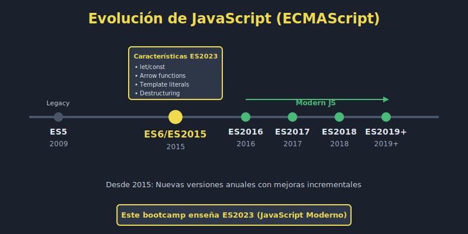

# 🚀 Introducción a JavaScript Moderno (ES2023)

## 🎯 Objetivos

- Comprender la evolución de JavaScript y ECMAScript
- Conocer las características clave de ES2023
- Entender por qué ES2023 es el estándar actual
- Identificar las diferencias entre JavaScript antiguo y moderno

---

## 📖 ¿Qué es ECMAScript?

**ECMAScript** es el estándar que define JavaScript. Piensa en ECMAScript como las "reglas del juego" y JavaScript como el "juego" en sí.

### Historia Rápida

```
1995  → JavaScript creado por Brendan Eich (Netscape)
1997  → ECMAScript 1 (ES1) - Primera estandarización
2009  → ECMAScript 5 (ES5) - Mejoras importantes
2015  → ECMAScript 6 (ES6/ES2015) - 🎉 REVOLUCIÓN
2016+ → ES2016, ES2017, ES2018... (actualizaciones anuales)
2024  → ECMAScript 2024 (ES15) - Última versión
```

> **💡 Nota**: ES6 también se conoce como ES2015. Fue la actualización más grande en la historia de JavaScript.

---

## 🌟 ¿Por qué ES2023 es tan importante?



### Antes de ES6 (JavaScript antiguo)

```javascript
// Variables sin control de scope
var nombre = 'Juan';
var edad = 25;

// Funciones verbosas
function saludar(nombre) {
  return 'Hola ' + nombre;
}

// Concatenación de strings complicada
var mensaje = 'Mi nombre es ' + nombre + ' y tengo ' + edad + ' años';

// Manipulación de objetos limitada
var persona = {
  nombre: 'Ana',
  edad: 30
};
var nombre = persona.nombre;
var edad = persona.edad;
```

### Con ES2023 (JavaScript moderno)

```javascript
// Variables con scope claro
const name = 'Juan';
const age = 25;

// Arrow functions concisas
const greet = name => `Hello ${name}`;

// Template literals elegantes
const message = `My name is ${name} and I'm ${age} years old`;

// Destructuring simplifica todo
const person = {
  name: 'Ana',
  age: 30
};
const { name, age } = person;
```

---

## 🎁 Características Principales de ES2023

### 1. **let y const** - Variables modernas

```javascript
// ✅ MODERNO
const PI = 3.14159;       // Constante, no cambiará
let counter = 0;          // Variable que puede cambiar

// ❌ ANTIGUO
var pi = 3.14159;
var counter = 0;
```

### 2. **Arrow Functions** - Sintaxis concisa

```javascript
// ✅ MODERNO
const double = x => x * 2;
const add = (a, b) => a + b;

// ❌ ANTIGUO
function double(x) {
  return x * 2;
}
```

### 3. **Template Literals** - Strings mejorados

```javascript
// ✅ MODERNO
const greeting = `Hello ${name}!`;
const multiline = `
  Line 1
  Line 2
`;

// ❌ ANTIGUO
var greeting = 'Hello ' + name + '!';
var multiline = 'Line 1\n' + 'Line 2';
```

### 4. **Destructuring** - Extraer valores fácilmente

```javascript
// ✅ MODERNO
const [first, second] = [1, 2, 3];
const { name, age } = user;

// ❌ ANTIGUO
var first = array[0];
var second = array[1];
var name = user.name;
var age = user.age;
```

### 5. **Spread Operator** - Expandir elementos

```javascript
// ✅ MODERNO
const numbers = [1, 2, 3];
const moreNumbers = [...numbers, 4, 5];
const newUser = { ...user, active: true };

// ❌ ANTIGUO
var moreNumbers = numbers.concat([4, 5]);
```

### 6. **Módulos ES6** - Organización de código

```javascript
// ✅ MODERNO
// file: utils.js
export const add = (a, b) => a + b;
export const PI = 3.14159;

// file: main.js
import { add, PI } from './utils.js';

// ❌ ANTIGUO (Node.js)
// file: utils.js
module.exports = {
  add: function(a, b) { return a + b; },
  PI: 3.14159
};

// file: main.js
var utils = require('./utils.js');
```

### 7. **Promises y Async/Await** - Código asíncrono

```javascript
// ✅ MODERNO (async/await)
const fetchData = async () => {
  const response = await fetch(url);
  const data = await response.json();
  return data;
};

// ❌ ANTIGUO (callbacks)
function fetchData(callback) {
  fetch(url, function(response) {
    response.json(function(data) {
      callback(data);
    });
  });
}
```

---

## 🔄 Versionamiento Anual desde ES6

Desde 2015, JavaScript recibe actualizaciones **anuales**:

| Versión    | Año  | Características Destacadas                      |
| ---------- | ---- | ----------------------------------------------- |
| **ES6**    | 2015 | let/const, arrows, classes, promises, modules   |
| **ES2016** | 2016 | Array.includes(), exponente (**)                |
| **ES2017** | 2017 | async/await, Object.entries()                   |
| **ES2018** | 2018 | Rest/spread para objetos, async iteration       |
| **ES2019** | 2019 | Array.flat(), Object.fromEntries()              |
| **ES2020** | 2020 | Optional chaining (?.), Nullish coalescing (??) |
| **ES2021** | 2021 | String.replaceAll(), Promise.any()              |
| **ES2022** | 2022 | Top-level await, class fields privados          |
| **ES2023** | 2023 | Array.toSorted(), Array.findLast()              |
| **ES2024** | 2024 | Array grouping, Promise.withResolvers()         |

---

## 🎯 ¿Qué Aprenderemos en Este Bootcamp?

### Fundamentos Modernos (Semanas 1-12)
- ✅ Variables: `let` y `const`
- ✅ Template literals
- ✅ Arrow functions
- ✅ Destructuring
- ✅ Spread/rest operators
- ✅ Módulos ES6
- ✅ Clases modernas
- ✅ Array methods: map, filter, reduce

### Intermedio (Semanas 13-24)
- ✅ Promises
- ✅ Async/await
- ✅ Fetch API
- ✅ Manejo de errores
- ✅ DOM moderno
- ✅ LocalStorage/SessionStorage

### Avanzado (Semanas 25-28)
- ✅ Testing con Jest
- ✅ Patrones de diseño
- ✅ Clean code
- ✅ Debugging

---

## 🚫 Lo que NO Enseñaremos

Este bootcamp se enfoca **exclusivamente en JavaScript moderno**, por lo que NO cubriremos:

- ❌ Sintaxis antigua con `var`
- ❌ Callbacks anidados (callback hell)
- ❌ Prototipos tradicionales (usaremos clases ES2023)
- ❌ `function` tradicional (usaremos arrows)
- ❌ Concatenación con `+` (usaremos template literals)
- ❌ Frameworks (React, Vue, Angular - son otro bootcamp)

> **🎯 Filosofía**: JavaScript moderno desde el día 1. Sin historia innecesaria.

---

## 🌐 Compatibilidad de Navegadores

### ¿ES6+ funciona en todos los navegadores?

**Respuesta corta**: Sí, en navegadores modernos (2015+).

### Navegadores Compatibles

- ✅ **Chrome** 51+ (2016)
- ✅ **Firefox** 54+ (2017)
- ✅ **Safari** 10+ (2016)
- ✅ **Edge** 15+ (2017)
- ✅ **Opera** 38+ (2016)

### ¿Y los navegadores antiguos?

Para navegadores antiguos (IE11, etc.), se usa **transpilación** con herramientas como Babel. Pero en este bootcamp nos enfocamos en desarrollo moderno.

```javascript
// Código moderno (ES2023)
const greet = name => `Hello ${name}`;

// Transpilado a ES5 (para IE11)
var greet = function(name) {
  return 'Hello ' + name;
};
```

> **💡 Nota**: Node.js 18+ soporta ES2023 nativamente, así que no necesitamos transpilación para desarrollo.

---

## 📊 Comparación Visual: Antes vs Ahora

### Ejemplo Completo

**Antes de ES6:**

```javascript
var usuario = {
  nombre: 'María',
  edad: 28,
  ciudad: 'Madrid'
};

function crearMensaje(usuario) {
  var nombre = usuario.nombre;
  var edad = usuario.edad;
  var ciudad = usuario.ciudad;

  return 'Hola, soy ' + nombre +
         ', tengo ' + edad + ' años' +
         ' y vivo en ' + ciudad;
}

var mensaje = crearMensaje(usuario);
console.log(mensaje);
```

**Con ES2023:**

```javascript
const user = {
  name: 'María',
  age: 28,
  city: 'Madrid'
};

const createMessage = ({ name, age, city }) =>
  `Hello, I'm ${name}, I'm ${age} years old and I live in ${city}`;

const message = createMessage(user);
console.log(message);
```

### Beneficios

- ✅ **Menos código**: 4 líneas vs 12 líneas
- ✅ **Más legible**: Sintaxis clara y directa
- ✅ **Más seguro**: `const` previene reasignaciones accidentales
- ✅ **Más moderno**: Estándar de la industria

---

## 🎓 Conceptos Clave

| Término            | Definición                                                |
| ------------------ | --------------------------------------------------------- |
| **ECMAScript**     | Estándar que define JavaScript                            |
| **ES6/ES2015**     | Versión que revolucionó JavaScript en 2015                |
| **Transpilación**  | Convertir código moderno a versiones antiguas             |
| **Babel**          | Herramienta popular para transpilar JavaScript            |
| **Polyfill**       | Código que añade funcionalidades faltantes en navegadores |
| **Compatibilidad** | Capacidad de código de ejecutarse en diferentes entornos  |

---

## ✅ Checklist de Verificación

Antes de continuar, asegúrate de entender:

- [ ] La diferencia entre JavaScript y ECMAScript
- [ ] Por qué ES6 fue una revolución
- [ ] Las características principales de ES2023
- [ ] Que JavaScript se actualiza anualmente desde 2015
- [ ] Que este bootcamp usa **solo** sintaxis moderna
- [ ] Que los navegadores modernos soportan ES2023 nativamente

---

## 🔗 Recursos Adicionales

### Documentación Oficial
- [ECMAScript Specification](https://tc39.es/ecma262/)
- [MDN: JavaScript](https://developer.mozilla.org/es/docs/Web/JavaScript)
- [Can I Use](https://caniuse.com/) - Compatibilidad de navegadores

### Lecturas Recomendadas
- [ES6 Features](http://es6-features.org/)
- [JavaScript.info: Modern JavaScript](https://javascript.info/)
- [Exploring ES6 (libro gratuito)](https://exploringjs.com/es6/)

---

## 🚀 Próximo Paso

Ahora que entiendes **qué es ES2023** y **por qué es importante**, es hora de empezar con las características concretas.

➡️ **Siguiente**: [let y const - Variables Modernas](02-let-const.md)

---

<p align="center">
  <strong>🎉 ¡Bienvenido a JavaScript moderno!</strong><br>
  <em>El futuro del desarrollo web comienza aquí</em>
</p>
