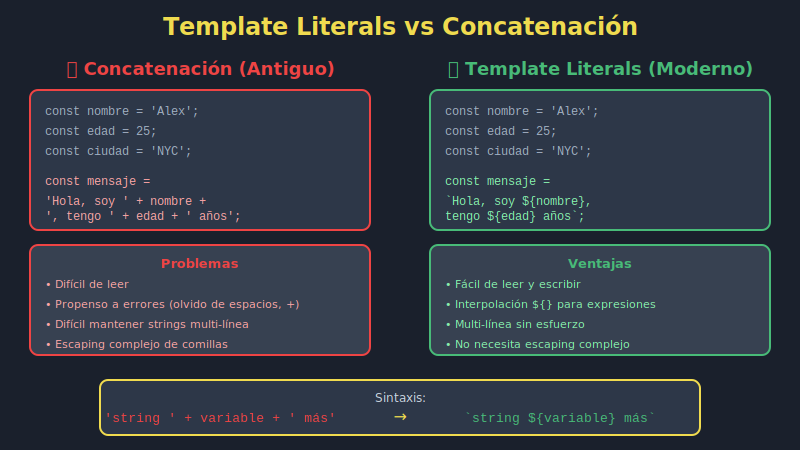

# 📝 Template Literals - Strings Modernos

## 🎯 Objetivos

- Dominar la sintaxis de template literals
- Crear strings con interpolación de variables
- Usar strings multilínea sin caracteres de escape
- Aplicar expresiones dentro de strings
- Evitar concatenación tradicional con `+`

---

## 📖 Introducción

**Template literals** (también llamados template strings) son la forma moderna de trabajar con strings en JavaScript. Usan **backticks** `` ` `` en lugar de comillas simples `'` o dobles `"`.

### Sintaxis Básica

```javascript
// ❌ ANTIGUO: Comillas simples o dobles
const greeting = 'Hello World';
const message = "Welcome to JavaScript";

// ✅ MODERNO: Backticks (template literals)
const modernGreeting = `Hello World`;
const modernMessage = `Welcome to JavaScript`;
```

---

## 🔤 Interpolación de Variables



### El Problema con Concatenación

```javascript
// ❌ ANTIGUO: Concatenación con +
const name = 'Ana';
const age = 25;
const city = 'Madrid';

const message = 'Hello, my name is ' + name +
                ', I am ' + age + ' years old' +
                ' and I live in ' + city;

console.log(message);
// "Hello, my name is Ana, I am 25 years old and I live in Madrid"
```

**Problemas:**
- ❌ Difícil de leer
- ❌ Propenso a errores (olvidar espacios)
- ❌ Código verboso
- ❌ Difícil de mantener

### La Solución: Template Literals

```javascript
// ✅ MODERNO: Template literals con interpolación
const name = 'Ana';
const age = 25;
const city = 'Madrid';

const message = `Hello, my name is ${name}, I am ${age} years old and I live in ${city}`;

console.log(message);
// "Hello, my name is Ana, I am 25 years old and I live in Madrid"
```

**Beneficios:**
- ✅ Muy legible
- ✅ Menos errores
- ✅ Código limpio
- ✅ Fácil de mantener

---

## 💰 Sintaxis ${expression}

La sintaxis `${expression}` permite insertar cualquier expresión JavaScript:

### Variables

```javascript
const userName = 'Carlos';
const message = `Welcome back, ${userName}!`;
// "Welcome back, Carlos!"
```

### Operaciones Matemáticas

```javascript
const price = 100;
const tax = 21;

const total = `Total: €${price + (price * tax / 100)}`;
// "Total: €121"

const discount = `Price with 20% off: €${price * 0.8}`;
// "Price with 20% off: €80"
```

### Llamadas a Funciones

```javascript
const getCurrentYear = () => new Date().getFullYear();

const footer = `© ${getCurrentYear()} My Company`;
// "© 2025 My Company"

const greeting = `Hello, ${getUserName().toUpperCase()}!`;
```

### Operador Ternario

```javascript
const age = 18;
const status = `You are ${age >= 18 ? 'an adult' : 'a minor'}`;
// "You are an adult"

const isLoggedIn = true;
const message = `${isLoggedIn ? 'Welcome back' : 'Please log in'}`;
// "Welcome back"
```

### Propiedades de Objetos

```javascript
const user = {
  name: 'María',
  role: 'Developer',
  level: 'Senior'
};

const badge = `${user.name} - ${user.level} ${user.role}`;
// "María - Senior Developer"
```

### Expresiones Complejas

```javascript
const items = [1, 2, 3, 4, 5];
const summary = `Total items: ${items.length}, Sum: ${items.reduce((a, b) => a + b)}`;
// "Total items: 5, Sum: 15"
```

---

## 📄 Strings Multilínea

### El Problema Antiguo

```javascript
// ❌ ANTIGUO: Caracteres de escape \n
const poem = 'Roses are red,\n' +
             'Violets are blue,\n' +
             'JavaScript is awesome,\n' +
             'And so are you!';

console.log(poem);
```

**Problemas:**
- ❌ Difícil de leer en el código
- ❌ Necesita concatenación
- ❌ Caracteres de escape

### La Solución Moderna

```javascript
// ✅ MODERNO: Template literals multilínea
const poem = `Roses are red,
Violets are blue,
JavaScript is awesome,
And so are you!`;

console.log(poem);
```

**Beneficios:**
- ✅ Se ve como el output
- ✅ Sin concatenación
- ✅ Sin caracteres de escape

### HTML Multilínea

```javascript
// ✅ Muy útil para generar HTML
const createCard = (name, role, email) => `
  <div class="card">
    <h2>${name}</h2>
    <p class="role">${role}</p>
    <a href="mailto:${email}">${email}</a>
  </div>
`;

const userCard = createCard('Ana García', 'Developer', 'ana@example.com');

document.body.innerHTML = userCard;
```

### SQL Queries

```javascript
// ✅ Útil para queries SQL
const userId = 123;
const query = `
  SELECT
    users.name,
    users.email,
    orders.total
  FROM users
  JOIN orders ON users.id = orders.user_id
  WHERE users.id = ${userId}
  ORDER BY orders.created_at DESC
`;
```

---

## 🎨 Casos de Uso Comunes

### 1. Mensajes de Usuario

```javascript
const userName = 'Carlos';
const points = 150;

const welcome = `Welcome ${userName}! You have ${points} points.`;
const levelUp = `Congratulations ${userName}! You reached level ${Math.floor(points / 50)}!`;
```

### 2. URLs Dinámicas

```javascript
const userId = 42;
const endpoint = 'users';

const apiUrl = `https://api.example.com/${endpoint}/${userId}`;
// "https://api.example.com/users/42"

const avatarUrl = `https://cdn.example.com/avatars/${userId}.jpg`;
// "https://cdn.example.com/avatars/42.jpg"
```

### 3. Formateo de Fechas

```javascript
const date = new Date();
const day = date.getDate();
const month = date.getMonth() + 1;
const year = date.getFullYear();

const formattedDate = `${day}/${month}/${year}`;
// "18/12/2025"

const isoDate = `${year}-${month.toString().padStart(2, '0')}-${day.toString().padStart(2, '0')}`;
// "2025-12-18"
```

### 4. Logging y Debugging

```javascript
const logError = (functionName, errorMessage) => {
  console.error(`[ERROR] in ${functionName}(): ${errorMessage}`);
};

const logSuccess = (action, itemCount) => {
  console.log(`[SUCCESS] ${action} completed: ${itemCount} items processed`);
};

logError('fetchData', 'Network timeout');
// "[ERROR] in fetchData(): Network timeout"

logSuccess('Import', 150);
// "[SUCCESS] Import completed: 150 items processed"
```

### 5. Generación de CSS

```javascript
const createStyle = (color, size, weight) => `
  color: ${color};
  font-size: ${size}px;
  font-weight: ${weight};
`;

const headingStyle = createStyle('#333', 24, 'bold');
element.style.cssText = headingStyle;
```

### 6. Configuración de Rutas

```javascript
const lang = 'es';
const section = 'products';
const id = 42;

const route = `/${lang}/${section}/${id}`;
// "/es/products/42"

const breadcrumb = `Home > ${section} > Item ${id}`;
// "Home > products > Item 42"
```

---

## 🚀 Ejemplos Avanzados

### Condicionales en Templates

```javascript
const user = {
  name: 'Ana',
  isPremium: true,
  points: 250
};

const message = `
  Hello ${user.name}!
  ${user.isPremium ? '⭐ Premium Member' : 'Free Member'}
  You have ${user.points} points${user.points > 200 ? ' - Amazing!' : ''}.
`;
```

### Listas Dinámicas

```javascript
const fruits = ['Apple', 'Banana', 'Orange'];

const fruitList = `
  <ul>
    ${fruits.map(fruit => `<li>${fruit}</li>`).join('')}
  </ul>
`;

// Output:
// <ul>
//   <li>Apple</li>
//   <li>Banana</li>
//   <li>Orange</li>
// </ul>
```

### Tablas de Datos

```javascript
const users = [
  { name: 'Ana', age: 25, role: 'Developer' },
  { name: 'Carlos', age: 30, role: 'Designer' },
  { name: 'Luis', age: 28, role: 'Manager' }
];

const table = `
  <table>
    <thead>
      <tr>
        <th>Name</th>
        <th>Age</th>
        <th>Role</th>
      </tr>
    </thead>
    <tbody>
      ${users.map(user => `
        <tr>
          <td>${user.name}</td>
          <td>${user.age}</td>
          <td>${user.role}</td>
        </tr>
      `).join('')}
    </tbody>
  </table>
`;
```

### Emails HTML

```javascript
const createEmailTemplate = (userName, orderNumber, total) => `
  <!DOCTYPE html>
  <html>
    <head>
      <title>Order Confirmation</title>
    </head>
    <body>
      <h1>Thank you for your order, ${userName}!</h1>
      <p>Your order #${orderNumber} has been confirmed.</p>
      <p><strong>Total: €${total.toFixed(2)}</strong></p>
      <p>We'll send you an email when your order ships.</p>
    </body>
  </html>
`;

const email = createEmailTemplate('Ana García', 'ORD-12345', 129.99);
```

---

## ⚠️ Errores Comunes

### Error 1: Usar Comillas en Lugar de Backticks

```javascript
// ❌ ERROR: Comillas no permiten interpolación
const name = 'Juan';
const message = 'Hello ${name}';
console.log(message);  // "Hello ${name}" (literal!)

// ✅ CORRECTO: Backticks
const correctMessage = `Hello ${name}`;
console.log(correctMessage);  // "Hello Juan"
```

### Error 2: Olvidar las Llaves {}

```javascript
// ❌ ERROR: Sin llaves
const age = 25;
const wrong = `I am $age years old`;
console.log(wrong);  // "I am $age years old"

// ✅ CORRECTO: Con llaves
const correct = `I am ${age} years old`;
console.log(correct);  // "I am 25 years old"
```

### Error 3: Espacios en Multilínea

```javascript
// ⚠️ CUIDADO: Los espacios se preservan
const indented = `
    This line has spaces
    at the beginning
`;
// "    This line has spaces\n    at the beginning\n"

// ✅ Solución 1: Sin indentación
const noIndent = `
This line has no spaces
at the beginning
`;

// ✅ Solución 2: trim()
const trimmed = `
    This will be trimmed
    at the edges
`.trim();
```

### Error 4: No Escapar Backticks Dentro del Template

```javascript
// ❌ ERROR: Backtick sin escapar
const code = `const message = `Hello`;`;  // SyntaxError

// ✅ CORRECTO: Escapar con \
const code = `const message = \`Hello\`;`;

// ✅ ALTERNATIVA: Usar comillas dentro
const code = `const message = 'Hello';`;
```

---

## 🆚 Comparación: Antes vs Ahora

### Ejemplo 1: Saludo Personalizado

```javascript
// ❌ ANTES
const firstName = 'Ana';
const lastName = 'García';
const age = 28;
const greeting = 'Hello, my name is ' + firstName + ' ' + lastName +
                 ' and I am ' + age + ' years old.';

// ✅ AHORA
const firstName = 'Ana';
const lastName = 'García';
const age = 28;
const greeting = `Hello, my name is ${firstName} ${lastName} and I am ${age} years old.`;
```

### Ejemplo 2: URL Builder

```javascript
// ❌ ANTES
const protocol = 'https';
const domain = 'api.example.com';
const version = 'v2';
const endpoint = 'users';
const id = 123;
const url = protocol + '://' + domain + '/' + version + '/' + endpoint + '/' + id;

// ✅ AHORA
const protocol = 'https';
const domain = 'api.example.com';
const version = 'v2';
const endpoint = 'users';
const id = 123;
const url = `${protocol}://${domain}/${version}/${endpoint}/${id}`;
```

### Ejemplo 3: HTML Card

```javascript
// ❌ ANTES
const title = 'Product Name';
const price = 99.99;
const stock = 5;
const html = '<div class="card">' +
             '<h3>' + title + '</h3>' +
             '<p>Price: €' + price + '</p>' +
             '<p>Stock: ' + stock + ' units</p>' +
             '</div>';

// ✅ AHORA
const title = 'Product Name';
const price = 99.99;
const stock = 5;
const html = `
  <div class="card">
    <h3>${title}</h3>
    <p>Price: €${price}</p>
    <p>Stock: ${stock} units</p>
  </div>
`;
```

---

## 💡 Tips y Trucos

### 1. Formateo de Números

```javascript
const price = 1234.56;
const formatted = `€${price.toFixed(2)}`;  // "€1234.56"
const withCommas = `€${price.toLocaleString('es-ES')}`;  // "€1.234,56"
```

### 2. Capitalización

```javascript
const name = 'ana garcía';
const capitalized = `${name.charAt(0).toUpperCase()}${name.slice(1)}`;
// "Ana garcía"
```

### 3. Truncar Texto

```javascript
const longText = 'This is a very long text that needs to be truncated';
const short = `${longText.slice(0, 20)}...`;
// "This is a very long ..."
```

### 4. Condicional Inline

```javascript
const isAvailable = true;
const status = `Status: ${isAvailable ? '✓ Available' : '✗ Out of stock'}`;
```

### 5. Valores por Defecto

```javascript
const userName = null;
const display = `User: ${userName || 'Guest'}`;
// "User: Guest"

const userAge = 0;
const ageDisplay = `Age: ${userAge ?? 'Not specified'}`;
// "Age: 0"
```

---

## 🧪 Ejercicios Prácticos

### Ejercicio 1: Conversión

Convierte este código a template literals:

```javascript
const product = 'Laptop';
const quantity = 2;
const price = 899;
const message = 'You ordered ' + quantity + ' ' + product +
                '(s) for a total of €' + (quantity * price);
```

<details>
<summary>Ver solución</summary>

```javascript
const product = 'Laptop';
const quantity = 2;
const price = 899;
const message = `You ordered ${quantity} ${product}(s) for a total of €${quantity * price}`;
```

</details>

### Ejercicio 2: Crear Tarjeta de Usuario

Crea una función que genere HTML para una tarjeta de usuario:

```javascript
const createUserCard = (name, email, age, isActive) => {
  // Tu código aquí
};

// Debe generar:
// <div class="user-card">
//   <h3>Nombre</h3>
//   <p>email@example.com</p>
//   <p>Age: 25</p>
//   <span class="badge">Active</span>
// </div>
```

<details>
<summary>Ver solución</summary>

```javascript
const createUserCard = (name, email, age, isActive) => `
  <div class="user-card">
    <h3>${name}</h3>
    <p>${email}</p>
    <p>Age: ${age}</p>
    <span class="badge">${isActive ? 'Active' : 'Inactive'}</span>
  </div>
`;
```

</details>

---

## 🎓 Conceptos Clave

| Término              | Definición                                     |
| -------------------- | ---------------------------------------------- |
| **Template Literal** | String con backticks que permite interpolación |
| **Interpolación**    | Insertar valores/expresiones dentro de strings |
| **Backtick**         | Carácter `` ` `` usado para template literals  |
| **${expression}**    | Sintaxis para interpolar expresiones           |
| **Multilínea**       | String que abarca varias líneas                |

---

## ✅ Checklist de Verificación

Antes de continuar, asegúrate de:

- [ ] Saber usar backticks `` ` `` para template literals
- [ ] Dominar la sintaxis `${variable}` para interpolación
- [ ] Poder insertar expresiones complejas en templates
- [ ] Crear strings multilínea sin `\n`
- [ ] Preferir template literals sobre concatenación con `+`
- [ ] Generar HTML dinámico con templates

---

## 🔗 Recursos Adicionales

- [MDN: Template Literals](https://developer.mozilla.org/es/docs/Web/JavaScript/Reference/Template_literals)
- [JavaScript.info: Template Literals](https://javascript.info/string#quotes)

---

## 🚀 Próximo Paso

Ahora que dominas los strings modernos, aprenderás la sintaxis más revolucionaria de ES6: arrow functions.

➡️ **Siguiente**: [Arrow Functions](04-arrow-functions.md)

---

<p align="center">
  <strong>📝 Template Literals Dominados</strong><br>
  <em>Adiós concatenación, hola interpolación</em>
</p>
