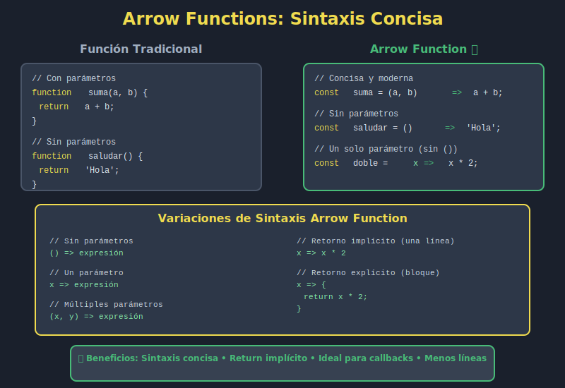

# ➡️ Arrow Functions - Funciones Modernas

## 🎯 Objetivos

- Dominar la sintaxis de arrow functions
- Comprender las diferencias con funciones tradicionales
- Saber cuándo usar arrow functions vs funciones regulares
- Entender el comportamiento de `this` en arrows
- Escribir código más conciso y legible

---

## 📖 Introducción

**Arrow functions** (funciones flecha) son una forma más concisa de escribir funciones en JavaScript. Se introdujeron en ES2023 y rápidamente se convirtieron en el estándar para funciones cortas.

### Sintaxis Básica

```javascript
// ❌ FUNCIÓN TRADICIONAL
function greet(name) {
  return `Hello ${name}`;
}

// ✅ ARROW FUNCTION
const greet = name => `Hello ${name}`;
```

---

## 📐 Sintaxis Completa



### Diferentes Formas

```javascript
// 1. Sin parámetros
const sayHello = () => 'Hello';

// 2. Un parámetro (paréntesis opcionales)
const double = x => x * 2;
const doubleAlt = (x) => x * 2;  // También válido

// 3. Múltiples parámetros (paréntesis requeridos)
const add = (a, b) => a + b;
const multiply = (x, y, z) => x * y * z;

// 4. Retorno implícito (una expresión)
const square = x => x * x;

// 5. Retorno explícito (bloque de código)
const complexCalc = (a, b) => {
  const sum = a + b;
  const product = a * b;
  return { sum, product };
};

// 6. Retornar objeto literal (necesita paréntesis)
const createUser = (name, age) => ({ name, age });
```

---

## 🔄 Comparación: Función Tradicional vs Arrow Function

### Ejemplo 1: Función Simple

```javascript
// ❌ TRADICIONAL
function double(x) {
  return x * 2;
}

// ✅ ARROW (con retorno implícito)
const double = x => x * 2;

// Uso
console.log(double(5));  // 10
```

### Ejemplo 2: Múltiples Parámetros

```javascript
// ❌ TRADICIONAL
function add(a, b) {
  return a + b;
}

// ✅ ARROW
const add = (a, b) => a + b;

// Uso
console.log(add(3, 4));  // 7
```

### Ejemplo 3: Sin Parámetros

```javascript
// ❌ TRADICIONAL
function getCurrentYear() {
  return new Date().getFullYear();
}

// ✅ ARROW
const getCurrentYear = () => new Date().getFullYear();

// Uso
console.log(getCurrentYear());  // 2025
```

### Ejemplo 4: Bloque de Código

```javascript
// ❌ TRADICIONAL
function calculateDiscount(price, discountPercent) {
  const discount = price * (discountPercent / 100);
  const finalPrice = price - discount;
  return finalPrice;
}

// ✅ ARROW
const calculateDiscount = (price, discountPercent) => {
  const discount = price * (discountPercent / 100);
  const finalPrice = price - discount;
  return finalPrice;
};

// Uso
console.log(calculateDiscount(100, 20));  // 80
```

---

## 💫 Retorno Implícito vs Explícito

### Retorno Implícito

Cuando la función es una **sola expresión**, se retorna automáticamente:

```javascript
// ✅ Retorno implícito (sin return ni llaves)
const double = x => x * 2;
const greet = name => `Hello ${name}`;
const isAdult = age => age >= 18;

// Equivalente a:
const double = x => { return x * 2; };
const greet = name => { return `Hello ${name}`; };
const isAdult = age => { return age >= 18; };
```

### Retorno Explícito

Cuando necesitas **múltiples líneas** o **lógica compleja**:

```javascript
// ✅ Retorno explícito (con return y llaves)
const processUser = user => {
  const fullName = `${user.firstName} ${user.lastName}`;
  const isActive = user.lastLogin > Date.now() - 86400000;
  return { fullName, isActive };
};

const validateEmail = email => {
  if (!email) return false;
  if (!email.includes('@')) return false;
  return true;
};
```

### Retornar Objetos Literales

**¡Cuidado!** Para retornar objetos con retorno implícito, usa paréntesis:

```javascript
// ❌ ERROR: Interpreta las llaves como bloque de código
const createUser = (name, age) => { name, age };  // SyntaxError

// ❌ ERROR: Sin return en bloque
const createUser = (name, age) => { name: name, age: age };  // SyntaxError

// ✅ CORRECTO: Paréntesis alrededor del objeto
const createUser = (name, age) => ({ name, age });

// ✅ ALTERNATIVA: Return explícito
const createUser = (name, age) => {
  return { name, age };
};

// Uso
const user = createUser('Ana', 25);
console.log(user);  // { name: 'Ana', age: 25 }
```

---

## 🎯 Casos de Uso Comunes

### 1. Array Methods

Arrow functions brillan con métodos de arrays:

```javascript
const numbers = [1, 2, 3, 4, 5];

// ✅ map
const doubled = numbers.map(n => n * 2);
// [2, 4, 6, 8, 10]

// ✅ filter
const evens = numbers.filter(n => n % 2 === 0);
// [2, 4]

// ✅ reduce
const sum = numbers.reduce((acc, n) => acc + n, 0);
// 15

// ✅ find
const firstEven = numbers.find(n => n % 2 === 0);
// 2

// ✅ sort
const sorted = numbers.sort((a, b) => b - a);
// [5, 4, 3, 2, 1]
```

### 2. Event Listeners

```javascript
// ✅ Click handler
button.addEventListener('click', () => {
  console.log('Button clicked!');
});

// ✅ Con parámetro event
input.addEventListener('input', e => {
  console.log(e.target.value);
});

// ✅ Multiple handlers
form.addEventListener('submit', e => {
  e.preventDefault();
  const data = new FormData(e.target);
  submitForm(data);
});
```

### 3. Callbacks

```javascript
// ✅ setTimeout
setTimeout(() => {
  console.log('Delayed message');
}, 1000);

// ✅ fetch
fetch('/api/users')
  .then(response => response.json())
  .then(data => console.log(data))
  .catch(error => console.error(error));

// ✅ Promise
const fetchData = () => {
  return new Promise((resolve, reject) => {
    // async operation
    resolve(data);
  });
};
```

### 4. Funciones de Utilidad

```javascript
// ✅ Formatters
const formatCurrency = amount => `€${amount.toFixed(2)}`;
const capitalize = str => str.charAt(0).toUpperCase() + str.slice(1);
const slugify = str => str.toLowerCase().replace(/\s+/g, '-');

// ✅ Validators
const isEmail = email => /^[^\s@]+@[^\s@]+\.[^\s@]+$/.test(email);
const isEmpty = value => !value || value.trim() === '';
const isValidAge = age => age >= 0 && age <= 120;

// ✅ Converters
const toNumber = str => Number(str);
const toBoolean = value => Boolean(value);
const toArray = value => Array.isArray(value) ? value : [value];
```

---

## 🔑 Diferencias Clave con Funciones Tradicionales

### 1. No Tienen `this` Propio

Arrow functions **heredan** `this` del contexto donde se definen:

```javascript
// ❌ PROBLEMA con función tradicional
const person = {
  name: 'Ana',
  hobbies: ['reading', 'coding'],
  showHobbies: function() {
    this.hobbies.forEach(function(hobby) {
      // ❌ this es undefined (o window en no-strict)
      console.log(`${this.name} likes ${hobby}`);
    });
  }
};

// ✅ SOLUCIÓN con arrow function
const person = {
  name: 'Ana',
  hobbies: ['reading', 'coding'],
  showHobbies: function() {
    this.hobbies.forEach(hobby => {
      // ✅ this se hereda del método showHobbies
      console.log(`${this.name} likes ${hobby}`);
    });
  }
};

person.showHobbies();
// "Ana likes reading"
// "Ana likes coding"
```

### 2. No Se Pueden Usar Como Constructores

```javascript
// ❌ ERROR: Arrow functions no pueden ser constructores
const Person = (name, age) => {
  this.name = name;
  this.age = age;
};

const ana = new Person('Ana', 25);  // TypeError: Person is not a constructor

// ✅ SOLUCIÓN: Usar clase o función tradicional
class Person {
  constructor(name, age) {
    this.name = name;
    this.age = age;
  }
}

const ana = new Person('Ana', 25);  // ✅ OK
```

### 3. No Tienen `arguments`

```javascript
// ❌ Arrow functions no tienen objeto arguments
const sum = () => {
  console.log(arguments);  // ReferenceError: arguments is not defined
};

// ✅ SOLUCIÓN: Usar rest parameters
const sum = (...numbers) => {
  return numbers.reduce((acc, n) => acc + n, 0);
};

console.log(sum(1, 2, 3, 4));  // 10
```

### 4. No Tienen `prototype`

```javascript
const arrowFunc = () => {};
console.log(arrowFunc.prototype);  // undefined

function regularFunc() {}
console.log(regularFunc.prototype);  // {}
```

---

## ⚖️ Cuándo Usar Arrow Functions

### ✅ USA Arrow Functions Para:

1. **Funciones cortas y simples**
   ```javascript
   const double = x => x * 2;
   const isEven = n => n % 2 === 0;
   ```

2. **Callbacks**
   ```javascript
   array.map(item => item.value);
   button.addEventListener('click', () => console.log('Clicked!'));
   ```

3. **Métodos de array**
   ```javascript
   numbers.filter(n => n > 10);
   users.sort((a, b) => a.age - b.age);
   ```

4. **Cuando necesitas heredar `this`**
   ```javascript
   class Timer {
     start() {
       setInterval(() => {
         this.tick();  // ✅ this se hereda
       }, 1000);
     }
   }
   ```

### ❌ NO Uses Arrow Functions Para:

1. **Métodos de objetos** (necesitan `this` propio)
   ```javascript
   // ❌ MAL
   const person = {
     name: 'Ana',
     greet: () => `Hello, I'm ${this.name}`  // this no es person
   };

   // ✅ BIEN
   const person = {
     name: 'Ana',
     greet() { return `Hello, I'm ${this.name}`; }
   };
   ```

2. **Constructores**
   ```javascript
   // ❌ MAL
   const Person = (name) => { this.name = name; };

   // ✅ BIEN
   class Person {
     constructor(name) { this.name = name; }
   }
   ```

3. **Cuando necesitas `arguments`**
   ```javascript
   // ❌ MAL (no funciona)
   const sum = () => {
     return Array.from(arguments).reduce((a, b) => a + b);
   };

   // ✅ BIEN
   const sum = (...args) => args.reduce((a, b) => a + b);
   ```

---

## 💡 Ejemplos del Mundo Real

### API Calls

```javascript
// ✅ Fetch data with error handling
const fetchUsers = async () => {
  try {
    const response = await fetch('/api/users');
    const users = await response.json();
    return users.filter(user => user.active);
  } catch (error) {
    console.error('Error fetching users:', error);
    return [];
  }
};
```

### Data Transformation

```javascript
const users = [
  { firstName: 'Ana', lastName: 'García', age: 25 },
  { firstName: 'Carlos', lastName: 'López', age: 30 },
  { firstName: 'María', lastName: 'Pérez', age: 28 }
];

// ✅ Transform data
const formatted = users
  .filter(user => user.age >= 26)
  .map(user => ({
    fullName: `${user.firstName} ${user.lastName}`,
    age: user.age
  }))
  .sort((a, b) => a.age - b.age);

console.log(formatted);
// [
//   { fullName: 'María Pérez', age: 28 },
//   { fullName: 'Carlos López', age: 30 }
// ]
```

### Form Validation

```javascript
const validators = {
  email: value => /^[^\s@]+@[^\s@]+\.[^\s@]+$/.test(value),
  minLength: min => value => value.length >= min,
  maxLength: max => value => value.length <= max,
  required: value => value.trim() !== ''
};

const validateField = (value, rules) => {
  return rules.every(rule => rule(value));
};

// Usage
const isValid = validateField('test@example.com', [
  validators.required,
  validators.email,
  validators.minLength(5)
]);
```

### State Management

```javascript
const createStore = initialState => {
  let state = initialState;
  const listeners = [];

  return {
    getState: () => state,
    setState: newState => {
      state = { ...state, ...newState };
      listeners.forEach(listener => listener(state));
    },
    subscribe: listener => {
      listeners.push(listener);
      return () => {
        const index = listeners.indexOf(listener);
        listeners.splice(index, 1);
      };
    }
  };
};
```

---

## ⚠️ Errores Comunes

### Error 1: Olvidar Paréntesis en Múltiples Parámetros

```javascript
// ❌ ERROR
const add = a, b => a + b;  // SyntaxError

// ✅ CORRECTO
const add = (a, b) => a + b;
```

### Error 2: Confundir Llaves con Objeto Literal

```javascript
// ❌ ERROR: Llaves interpretadas como bloque de código
const getUser = id => { id: id, name: 'User' };  // SyntaxError

// ✅ CORRECTO: Paréntesis alrededor del objeto
const getUser = id => ({ id: id, name: 'User' });
```

### Error 3: Usar `this` en Arrow Method

```javascript
// ❌ ERROR: this no se refiere al objeto
const counter = {
  count: 0,
  increment: () => {
    this.count++;  // this no es counter
  }
};

// ✅ CORRECTO: Método tradicional o shorthand
const counter = {
  count: 0,
  increment() {
    this.count++;
  }
};
```

### Error 4: Return en Retorno Implícito

```javascript
// ❌ ERROR: Return con retorno implícito
const double = x => return x * 2;  // SyntaxError

// ✅ CORRECTO: Sin return
const double = x => x * 2;

// ✅ O con llaves y return
const double = x => { return x * 2; };
```

---

## 🧪 Ejercicios Prácticos

### Ejercicio 1: Conversión

Convierte estas funciones a arrow functions:

```javascript
function square(x) {
  return x * x;
}

function isEven(n) {
  return n % 2 === 0;
}

function greetUser(name, greeting) {
  return greeting + ', ' + name + '!';
}
```

<details>
<summary>Ver solución</summary>

```javascript
const square = x => x * x;

const isEven = n => n % 2 === 0;

const greetUser = (name, greeting) => `${greeting}, ${name}!`;
```

</details>

### Ejercicio 2: Array Methods

Usa arrow functions para:
1. Filtrar números mayores a 10
2. Duplicar cada número
3. Sumar todos los números

```javascript
const numbers = [5, 12, 8, 130, 44];

// Tu código aquí
```

<details>
<summary>Ver solución</summary>

```javascript
const numbers = [5, 12, 8, 130, 44];

const greaterThan10 = numbers.filter(n => n > 10);
// [12, 130, 44]

const doubled = numbers.map(n => n * 2);
// [10, 24, 16, 260, 88]

const sum = numbers.reduce((acc, n) => acc + n, 0);
// 199
```

</details>

---

## 🎓 Conceptos Clave

| Término               | Definición                                   |
| --------------------- | -------------------------------------------- |
| **Arrow Function**    | Sintaxis concisa para funciones con `=>`     |
| **Retorno Implícito** | Return automático sin palabra clave `return` |
| **Lexical this**      | `this` heredado del contexto padre           |
| **Rest Parameters**   | `...args` para capturar múltiples argumentos |
| **Callback**          | Función pasada como argumento a otra función |

---

## ✅ Checklist de Verificación

Antes de continuar, asegúrate de:

- [ ] Dominar la sintaxis básica de arrow functions
- [ ] Entender retorno implícito vs explícito
- [ ] Saber retornar objetos literales con paréntesis
- [ ] Comprender el comportamiento de `this` en arrows
- [ ] Saber cuándo usar arrows vs funciones tradicionales
- [ ] Poder usar arrows con métodos de array

---

## 🔗 Recursos Adicionales

- [MDN: Arrow Functions](https://developer.mozilla.org/es/docs/Web/JavaScript/Reference/Functions/Arrow_functions)
- [JavaScript.info: Arrow Functions](https://javascript.info/arrow-functions-basics)

---

## 🚀 Próximo Paso

Ahora que dominas arrow functions, aprenderás a simplificar el acceso a datos con destructuring.

➡️ **Siguiente**: [Destructuring Básico](05-destructuring-basico.md)

---

<p align="center">
  <strong>➡️ Arrow Functions Dominadas</strong><br>
  <em>Funciones concisas, código elegante</em>
</p>
