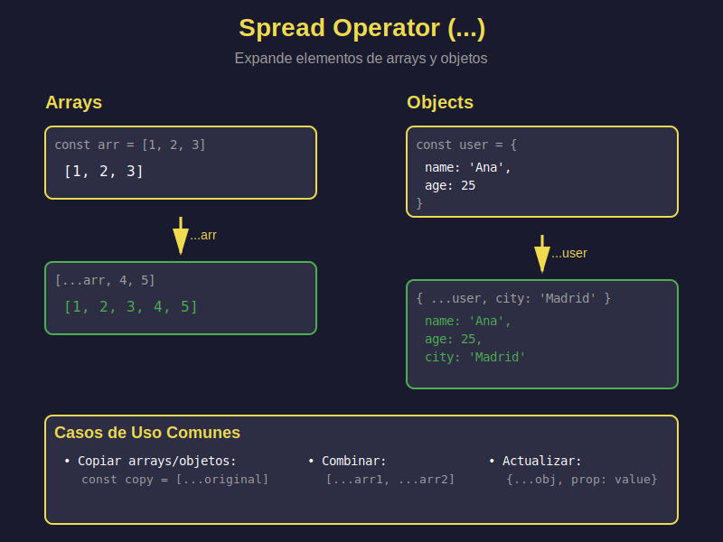

# 📦 Spread Operator (`...`)



## 🎯 Objetivos

- Comprender qué es y cómo funciona el spread operator
- Usar spread para copiar arrays y objetos
- Combinar múltiples arrays y objetos
- Pasar arrays como argumentos a funciones
- Aplicar spread en casos de uso reales

---

## 📖 Introducción

El **spread operator** (`...`) es uno de los operadores más útiles de ES2023. Permite "expandir" o "desempaquetar" elementos de un iterable (array, objeto, string) en lugares donde se esperan múltiples elementos.

### Sintaxis Básica

```javascript
const array = [1, 2, 3];
const expanded = [...array]; // Spread expande los elementos

console.log(...array);  // 1 2 3 (elementos separados)
console.log(expanded);  // [1, 2, 3] (nuevo array)
```

> **💡 Importante**: Spread **crea una copia superficial** (shallow copy), no profunda.

---

## 📚 Spread en Arrays

### 1. Copiar Arrays

```javascript
// ❌ ANTIGUO: Copia por referencia (peligroso)
const original = [1, 2, 3];
const copia = original;
copia.push(4);
console.log(original); // [1, 2, 3, 4] - ¡Se modificó el original!

// ✅ MODERNO: Spread crea nueva copia
const original2 = [1, 2, 3];
const copia2 = [...original2];
copia2.push(4);
console.log(original2); // [1, 2, 3] - Original intacto
console.log(copia2);    // [1, 2, 3, 4]
```

### 2. Combinar Arrays

```javascript
// ❌ ANTIGUO: concat()
const arr1 = [1, 2];
const arr2 = [3, 4];
const combined = arr1.concat(arr2);

// ✅ MODERNO: Spread
const combined = [...arr1, ...arr2];
console.log(combined); // [1, 2, 3, 4]

// Múltiples arrays
const arr3 = [5, 6];
const allCombined = [...arr1, ...arr2, ...arr3];
console.log(allCombined); // [1, 2, 3, 4, 5, 6]

// Insertar en medio
const middle = [...arr1, 99, ...arr2];
console.log(middle); // [1, 2, 99, 3, 4]
```

### 3. Agregar Elementos

```javascript
const numbers = [2, 3, 4];

// Agregar al inicio
const withFirst = [1, ...numbers];
console.log(withFirst); // [1, 2, 3, 4]

// Agregar al final
const withLast = [...numbers, 5];
console.log(withLast); // [2, 3, 4, 5]

// Agregar en ambos extremos
const withBoth = [0, ...numbers, 6];
console.log(withBoth); // [0, 2, 3, 4, 6]
```

### 4. Convertir String a Array

```javascript
const str = 'Hello';
const chars = [...str];
console.log(chars); // ['H', 'e', 'l', 'l', 'o']

// Útil para procesar caracteres
const upperChars = [...str].map(char => char.toUpperCase());
console.log(upperChars); // ['H', 'E', 'L', 'L', 'O']
```

---

## 🎯 Spread en Objetos

### 1. Copiar Objetos

```javascript
// ❌ ANTIGUO: Object.assign()
const user = { name: 'Ana', age: 25 };
const copy = Object.assign({}, user);

// ✅ MODERNO: Spread
const copy = { ...user };

copy.age = 26;
console.log(user); // { name: 'Ana', age: 25 } - Original intacto
console.log(copy); // { name: 'Ana', age: 26 }
```

### 2. Combinar Objetos

```javascript
const personal = {
  name: 'Carlos',
  age: 30
};

const professional = {
  job: 'Developer',
  company: 'TechCorp'
};

// Combinar
const profile = { ...personal, ...professional };
console.log(profile);
// {
//   name: 'Carlos',
//   age: 30,
//   job: 'Developer',
//   company: 'TechCorp'
// }
```

### 3. Sobrescribir Propiedades

```javascript
const defaults = {
  theme: 'light',
  fontSize: 14,
  language: 'en'
};

const userPrefs = {
  theme: 'dark',
  fontSize: 16
};

// userPrefs sobrescribe defaults
const config = { ...defaults, ...userPrefs };
console.log(config);
// {
//   theme: 'dark',       // Sobrescrito
//   fontSize: 16,        // Sobrescrito
//   language: 'en'       // Del default
// }
```

### 4. Actualizar Propiedades Inmutablemente

```javascript
const user = {
  id: 1,
  name: 'Laura',
  email: 'laura@example.com',
  age: 28
};

// Actualizar edad sin mutar el original
const updatedUser = {
  ...user,
  age: 29  // Nueva edad
};

console.log(user);        // age: 28 (original intacto)
console.log(updatedUser); // age: 29 (nuevo objeto)
```

---

## 🔧 Spread con Funciones

### Pasar Arrays como Argumentos

```javascript
const numbers = [5, 3, 9, 1];

// ❌ ANTIGUO: apply()
const max = Math.max.apply(null, numbers);

// ✅ MODERNO: Spread
const max = Math.max(...numbers);
console.log(max); // 9

const min = Math.min(...numbers);
console.log(min); // 1

// Función personalizada
const sum = (a, b, c) => a + b + c;
const values = [10, 20, 30];
console.log(sum(...values)); // 60
```

---

## 💼 Casos de Uso Reales

### 1. Agregar Item a Lista (Inmutable)

```javascript
const todos = [
  { id: 1, text: 'Learn JS', done: true },
  { id: 2, text: 'Build app', done: false }
];

const newTodo = { id: 3, text: 'Deploy', done: false };

// Agregar sin mutar
const updatedTodos = [...todos, newTodo];
```

### 2. Remover Item de Lista

```javascript
const items = ['apple', 'banana', 'orange'];
const indexToRemove = 1;

// Crear nuevo array sin el item
const newItems = [
  ...items.slice(0, indexToRemove),
  ...items.slice(indexToRemove + 1)
];
console.log(newItems); // ['apple', 'orange']
```

### 3. Actualizar Item en Lista

```javascript
const products = [
  { id: 1, name: 'Laptop', price: 1000 },
  { id: 2, name: 'Mouse', price: 25 },
  { id: 3, name: 'Keyboard', price: 75 }
];

// Actualizar precio del Mouse (id: 2)
const updatedProducts = products.map(product =>
  product.id === 2
    ? { ...product, price: 30 }  // Spread + actualización
    : product
);
```

### 4. Merge de Configuraciones

```javascript
const defaultConfig = {
  api: 'https://api.example.com',
  timeout: 5000,
  retries: 3,
  cache: true
};

const userConfig = {
  timeout: 10000,
  retries: 5
};

const finalConfig = { ...defaultConfig, ...userConfig };
console.log(finalConfig);
// {
//   api: 'https://api.example.com',
//   timeout: 10000,  // User override
//   retries: 5,      // User override
//   cache: true
// }
```

---

## ⚠️ Limitaciones y Caveats

### 1. Shallow Copy (Copia Superficial)

```javascript
const user = {
  name: 'Ana',
  address: {
    city: 'Madrid',
    country: 'Spain'
  }
};

const copy = { ...user };

// Problema: objetos anidados se copian por referencia
copy.address.city = 'Barcelona';

console.log(user.address.city);  // 'Barcelona' - ¡Se modificó el original!
console.log(copy.address.city);  // 'Barcelona'

// Solución: Deep copy manual
const deepCopy = {
  ...user,
  address: { ...user.address }  // Copiar anidados también
};
```

### 2. No Funciona con Sets y Maps Directamente

```javascript
const set = new Set([1, 2, 3]);
const arr = [...set]; // ✅ Esto sí funciona (Set a Array)

const map = new Map([['a', 1], ['b', 2]]);
const entries = [...map]; // ✅ [[a, 1], ['b', 2]]
```

### 3. Orden de Propiedades Importa

```javascript
const obj = { a: 1, b: 2 };

const result1 = { ...obj, b: 3 };
console.log(result1); // { a: 1, b: 3 } - b sobrescrito

const result2 = { b: 3, ...obj };
console.log(result2); // { b: 2, a: 1 } - spread sobrescribe b: 3
```

---

## 🎯 Ejercicios Prácticos

### Ejercicio 1: Combinar Arrays
```javascript
// Combina estos arrays en uno solo
const frontend = ['HTML', 'CSS', 'JavaScript'];
const backend = ['Node.js', 'Express'];
const database = ['MongoDB', 'PostgreSQL'];

// Tu solución aquí
const fullStack = // ???

console.log(fullStack);
// Esperado: ['HTML', 'CSS', 'JavaScript', 'Node.js', 'Express', 'MongoDB', 'PostgreSQL']
```

### Ejercicio 2: Actualizar Objeto
```javascript
const product = {
  id: 101,
  name: 'Laptop',
  price: 999,
  inStock: true
};

// Crea un nuevo objeto con el precio actualizado a 899
const updatedProduct = // ???

console.log(product.price);        // 999 (original intacto)
console.log(updatedProduct.price); // 899
```

### Ejercicio 3: Agregar Elemento al Inicio
```javascript
const numbers = [2, 3, 4, 5];

// Agrega el número 1 al inicio sin mutar el original
const newNumbers = // ???

console.log(numbers);    // [2, 3, 4, 5] (original)
console.log(newNumbers); // [1, 2, 3, 4, 5]
```

---

## ✅ Soluciones

<details>
<summary>Ver Soluciones</summary>

```javascript
// Ejercicio 1
const fullStack = [...frontend, ...backend, ...database];

// Ejercicio 2
const updatedProduct = { ...product, price: 899 };

// Ejercicio 3
const newNumbers = [1, ...numbers];
```
</details>

---

## 🎓 Conceptos Clave

- **Spread Operator (`...`)**: Expande elementos de iterables
- **Shallow Copy**: Copia primer nivel, anidados por referencia
- **Immutability**: Spread ayuda a no mutar originales
- **Combinar**: Unir múltiples arrays/objetos
- **Orden importa**: El último sobrescribe al primero

---

## 📚 Recursos Adicionales

- [MDN - Spread syntax](https://developer.mozilla.org/es/docs/Web/JavaScript/Reference/Operators/Spread_syntax)
- [JavaScript.info - Spread operator](https://javascript.info/rest-parameters-spread)
- [ES6 Features - Spread](http://es6-features.org/#SpreadOperator)

---

## 🔗 Navegación

- [← Volver al README de la Semana](../README.md)
- [→ Siguiente: Rest Parameters](02-rest-parameters.md)

---

_Semana 02 - JavaScript Moderno Bootcamp_
