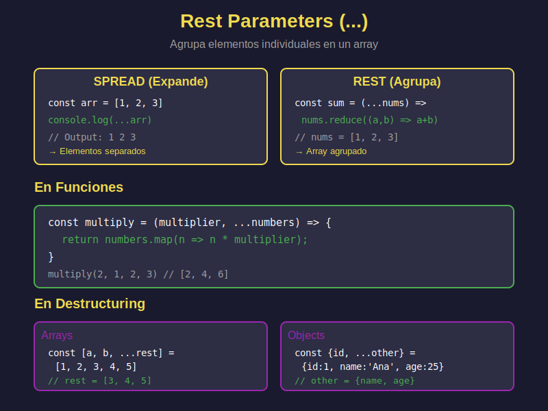

# 🎒 Rest Parameters (`...`)

## 🎯 Objetivos

- Comprender la diferencia entre spread y rest
- Usar rest parameters en funciones
- Combinar rest con parámetros normales
- Aplicar rest en destructuring
- Dominar patrones comunes con rest

---

## 📖 Introducción

**Rest parameters** usan la misma sintaxis que spread (`...`) pero con un propósito opuesto:
- **Spread**: Expande elementos → `[...array]`
- **Rest**: Agrupa elementos → `function(...args)`

### Diferencia Visual

```javascript
// SPREAD - Expande un array en elementos individuales
const numbers = [1, 2, 3];
console.log(...numbers); // 1 2 3

// REST - Agrupa elementos individuales en un array
const sum = (...numbers) => numbers.reduce((a, b) => a + b);
sum(1, 2, 3); // numbers = [1, 2, 3]
```

---

## 🔧 Rest en Funciones

### 1. Función con Argumentos Ilimitados

```javascript
// ❌ ANTIGUO: arguments object
function sumOld() {
  const args = Array.from(arguments); // Convertir a array
  return args.reduce((a, b) => a + b);
}

// ✅ MODERNO: Rest parameters
const sum = (...numbers) => {
  return numbers.reduce((total, num) => total + num, 0);
};

console.log(sum(1, 2, 3));        // 6
console.log(sum(10, 20, 30, 40)); // 100
```

### 2. Combinar con Parámetros Normales

```javascript
// Primer parámetro normal, resto con rest
const multiply = (multiplier, ...numbers) => {
  return numbers.map(num => num * multiplier);
};

console.log(multiply(2, 1, 2, 3));    // [2, 4, 6]
console.log(multiply(10, 5, 10, 15)); // [50, 100, 150]

// Múltiples parámetros normales + rest
const createUser = (name, age, ...hobbies) => {
  return {
    name,
    age,
    hobbies
  };
};

console.log(createUser('Ana', 25, 'reading', 'coding', 'gaming'));
// { name: 'Ana', age: 25, hobbies: ['reading', 'coding', 'gaming'] }
```

### 3. Rest DEBE ser el Último Parámetro

```javascript
// ✅ CORRECTO
const func1 = (a, b, ...rest) => {};

// ❌ ERROR: Rest debe ser último
// const func2 = (...rest, a, b) => {}; // SyntaxError

// ❌ ERROR: Solo un rest parameter
// const func3 = (...rest1, ...rest2) => {}; // SyntaxError
```

---

## 📦 Rest en Destructuring

### Arrays

```javascript
const numbers = [1, 2, 3, 4, 5];

// Tomar primeros elementos y agrupar el resto
const [first, second, ...rest] = numbers;

console.log(first);  // 1
console.log(second); // 2
console.log(rest);   // [3, 4, 5]

// Solo el primero y el resto
const [head, ...tail] = numbers;
console.log(head); // 1
console.log(tail); // [2, 3, 4, 5]

// Saltar elementos
const [a, , , ...others] = numbers;
console.log(a);      // 1
console.log(others); // [4, 5]
```

### Objetos

```javascript
const user = {
  id: 1,
  name: 'Carlos',
  email: 'carlos@example.com',
  age: 30,
  city: 'Madrid'
};

// Extraer propiedades específicas, resto en ...other
const { id, name, ...otherInfo } = user;

console.log(id);        // 1
console.log(name);      // 'Carlos'
console.log(otherInfo); // { email: '...', age: 30, city: 'Madrid' }

// Útil para remover propiedades
const { password, ...publicUser } = {
  id: 1,
  username: 'john',
  password: 'secret123',
  email: 'john@example.com'
};

console.log(publicUser); // Sin password
// { id: 1, username: 'john', email: 'john@example.com' }
```

---

## 💼 Casos de Uso Reales

### 1. Logger Flexible

```javascript
const log = (level, message, ...metadata) => {
  const timestamp = new Date().toISOString();
  console.log(`[${timestamp}] [${level}] ${message}`);

  if (metadata.length > 0) {
    console.log('Metadata:', metadata);
  }
};

log('INFO', 'User logged in');
log('ERROR', 'Database connection failed', 'timeout', 5000);
log('DEBUG', 'Processing request', { userId: 123, method: 'POST' });
```

### 2. Wrapper de Fetch

```javascript
const apiCall = async (endpoint, ...options) => {
  const defaultOptions = {
    headers: {
      'Content-Type': 'application/json'
    }
  };

  const mergedOptions = {
    ...defaultOptions,
    ...Object.assign({}, ...options)
  };

  return fetch(endpoint, mergedOptions);
};

// Uso
apiCall('/api/users', { method: 'POST' }, { body: JSON.stringify(data) });
```

### 3. Validador de Formularios

```javascript
const validateFields = (requiredFields, ...fields) => {
  const errors = [];

  requiredFields.forEach(required => {
    if (!fields.includes(required)) {
      errors.push(`Missing field: ${required}`);
    }
  });

  return {
    isValid: errors.length === 0,
    errors
  };
};

const result = validateFields(
  ['name', 'email'],
  'name',
  'email',
  'phone'
);
console.log(result); // { isValid: true, errors: [] }
```

### 4. Función de Estadísticas

```javascript
const stats = (...numbers) => {
  if (numbers.length === 0) return null;

  const sum = numbers.reduce((a, b) => a + b, 0);
  const avg = sum / numbers.length;
  const max = Math.max(...numbers); // Spread aquí!
  const min = Math.min(...numbers);

  return { sum, avg, max, min, count: numbers.length };
};

console.log(stats(10, 20, 30, 40, 50));
// { sum: 150, avg: 30, max: 50, min: 10, count: 5 }
```

---

## 🆚 Spread vs Rest: Tabla Comparativa

| Aspecto       | Spread (`...`)                     | Rest (`...`)                         |
| ------------- | ---------------------------------- | ------------------------------------ |
| **Propósito** | Expandir elementos                 | Agrupar elementos                    |
| **Uso**       | Donde se esperan múltiples valores | Parámetros de función, destructuring |
| **Dirección** | De array/objeto → elementos        | De elementos → array                 |
| **Ejemplo**   | `func(...arr)`                     | `func(...args) {}`                   |
| **Resultado** | Elementos separados                | Array con elementos                  |

### Ejemplos Lado a Lado

```javascript
// SPREAD: Array a elementos
const arr = [1, 2, 3];
console.log(...arr);      // 1 2 3
Math.max(...arr);         // Pasa elementos individuales

// REST: Elementos a array
const sum = (...nums) => nums.reduce((a, b) => a + b);
sum(1, 2, 3);            // Agrupa en [1, 2, 3]

// AMBOS en una función
const merge = (...arrays) => {  // REST: agrupa argumentos
  return [].concat(...arrays);  // SPREAD: expande cada array
};

merge([1, 2], [3, 4], [5, 6]); // [1, 2, 3, 4, 5, 6]
```

---

## 🎯 Ejercicios Prácticos

### Ejercicio 1: Función Average

```javascript
// Crea una función que calcule el promedio de cualquier cantidad de números
const average = // ???

console.log(average(10, 20, 30));       // 20
console.log(average(5, 10, 15, 20, 25)); // 15
```

### Ejercicio 2: First and Rest

```javascript
const names = ['Ana', 'Bob', 'Carlos', 'Diana'];

// Extrae el primer nombre y agrupa el resto
const [first, ...others] = // ???

console.log(first);  // 'Ana'
console.log(others); // ['Bob', 'Carlos', 'Diana']
```

### Ejercicio 3: Remover Propiedad

```javascript
const product = {
  id: 101,
  name: 'Laptop',
  price: 999,
  internalCode: 'LP-2024-001'
};

// Crea un nuevo objeto sin internalCode
const { internalCode, ...publicProduct } = // ???

console.log(publicProduct);
// { id: 101, name: 'Laptop', price: 999 }
```

---

## ✅ Soluciones

<details>
<summary>Ver Soluciones</summary>

```javascript
// Ejercicio 1
const average = (...numbers) => {
  const sum = numbers.reduce((a, b) => a + b, 0);
  return sum / numbers.length;
};

// Ejercicio 2
const [first, ...others] = names;

// Ejercicio 3
const { internalCode, ...publicProduct } = product;
```
</details>

---

## 🎓 Conceptos Clave

- **Rest Parameters**: Agrupa argumentos en un array
- **Diferencia con Spread**: Spread expande, Rest agrupa
- **Posición**: Rest DEBE ser el último parámetro
- **Destructuring**: Útil para extraer y agrupar
- **Flexibilidad**: Funciones con argumentos variables

---

## 📚 Recursos Adicionales

- [MDN - Rest parameters](https://developer.mozilla.org/es/docs/Web/JavaScript/Reference/Functions/rest_parameters)
- [JavaScript.info - Rest parameters](https://javascript.info/rest-parameters-spread#rest-parameters)

---

## 🔗 Navegación

- [← Anterior: Spread Operator](01-spread-operator.md)
- [→ Siguiente: Default Parameters](03-default-parameters.md)
- [↑ Volver al README](../README.md)

---

_Semana 02 - JavaScript Moderno Bootcamp_
