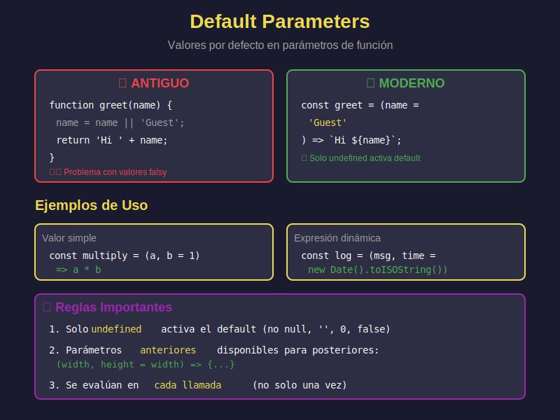

# 🎯 Default Parameters (Parámetros por Defecto)



## 🎯 Objetivos

- Definir valores por defecto en parámetros
- Usar expresiones como valores por defecto
- Combinar con destructuring
- Entender el orden de evaluación
- Aplicar patrones avanzados

---

## 📖 Introducción

Los **default parameters** permiten inicializar parámetros con valores por defecto cuando no se proporcionan o son `undefined`.

### Comparación: Antes vs Ahora

```javascript
// ❌ ANTIGUO: Verificación manual
function greetOld(name) {
  name = name || 'Guest';
  return 'Hello, ' + name;
}

// ⚠️ PROBLEMA: Valores falsy rompen la lógica
greetOld('');    // 'Hello, Guest' ('' es falsy)
greetOld(0);     // 'Hello, Guest' (0 es falsy)

// ✅ MODERNO: Default parameters
const greet = (name = 'Guest') => {
  return `Hello, ${name}`;
};

greet();         // 'Hello, Guest'
greet('Ana');    // 'Hello, Ana'
greet('');       // 'Hello, ' ('' se respeta)
greet(undefined); // 'Hello, Guest'
```

---

## 🔧 Sintaxis Básica

### Valores Simples

```javascript
// Números
const multiply = (a, b = 1) => a * b;
console.log(multiply(5));    // 5
console.log(multiply(5, 2)); // 10

// Strings
const createMessage = (text, prefix = 'INFO') => {
  return `[${prefix}] ${text}`;
};

console.log(createMessage('Server started'));
// '[INFO] Server started'

console.log(createMessage('Error occurred', 'ERROR'));
// '[ERROR] Error occurred'

// Booleans
const createUser = (name, isActive = true) => {
  return { name, isActive };
};

console.log(createUser('Ana'));
// { name: 'Ana', isActive: true }

// Arrays
const joinWords = (words = []) => words.join(', ');
console.log(joinWords());              // ''
console.log(joinWords(['a', 'b', 'c'])); // 'a, b, c'

// Objetos
const configure = (options = {}) => {
  return {
    theme: 'dark',
    language: 'es',
    ...options
  };
};

console.log(configure());
// { theme: 'dark', language: 'es' }
console.log(configure({ theme: 'light' }));
// { theme: 'light', language: 'es' }
```

---

## 🧮 Expresiones como Valores por Defecto

### Cálculos Dinámicos

```javascript
// Función como valor por defecto
const log = (message, timestamp = new Date().toISOString()) => {
  return `[${timestamp}] ${message}`;
};

log('Event 1'); // '[2024-01-15T10:30:00.000Z] Event 1'

// Operaciones matemáticas
const createRange = (start = 0, end = start + 10) => {
  return Array.from({ length: end - start }, (_, i) => start + i);
};

console.log(createRange());      // [0, 1, 2, ..., 9]
console.log(createRange(5));     // [5, 6, 7, ..., 14]
console.log(createRange(5, 10)); // [5, 6, 7, 8, 9]

// Llamadas a funciones
const generateId = () => Math.random().toString(36).substr(2, 9);

const createItem = (name, id = generateId()) => {
  return { id, name };
};

console.log(createItem('Product A'));
// { id: 'x8f3k2m1p', name: 'Product A' }
```

### Dependencias entre Parámetros

```javascript
// Parámetros posteriores pueden usar anteriores
const createBox = (width, height = width, depth = width) => {
  return { width, height, depth };
};

console.log(createBox(10));
// { width: 10, height: 10, depth: 10 } (cubo)

console.log(createBox(10, 20));
// { width: 10, height: 20, depth: 10 }

console.log(createBox(10, 20, 30));
// { width: 10, height: 20, depth: 30 }

// ❌ No puedes referenciar parámetros posteriores
const bad = (a = b, b = 1) => a + b; // ReferenceError
```

---

## 📦 Combinación con Destructuring

### Objetos

```javascript
// Default en destructuring de parámetros
const createProfile = ({ name, age = 18, country = 'Spain' }) => {
  return { name, age, country };
};

console.log(createProfile({ name: 'Ana' }));
// { name: 'Ana', age: 18, country: 'Spain' }

console.log(createProfile({ name: 'Bob', age: 25 }));
// { name: 'Bob', age: 25, country: 'Spain' }

// ⚠️ PROBLEMA: Si no pasas objeto, error
// createProfile(); // TypeError: Cannot destructure 'undefined'

// ✅ SOLUCIÓN: Default en el parámetro completo
const createProfileSafe = ({ name, age = 18, country = 'Spain' } = {}) => {
  return { name, age, country };
};

console.log(createProfileSafe());
// { name: undefined, age: 18, country: 'Spain' }

// Valores por defecto anidados
const connect = ({
  host = 'localhost',
  port = 3000,
  credentials = { user: 'guest', password: '' }
} = {}) => {
  return { host, port, credentials };
};

console.log(connect());
// { host: 'localhost', port: 3000, credentials: {...} }
```

### Arrays

```javascript
const processCoordinates = ([x = 0, y = 0, z = 0] = []) => {
  return { x, y, z };
};

console.log(processCoordinates());           // { x: 0, y: 0, z: 0 }
console.log(processCoordinates([10]));       // { x: 10, y: 0, z: 0 }
console.log(processCoordinates([10, 20]));   // { x: 10, y: 20, z: 0 }
```

---

## 💼 Casos de Uso Reales

### 1. Configuración de API Client

```javascript
const createApiClient = ({
  baseURL = 'https://api.example.com',
  timeout = 5000,
  headers = { 'Content-Type': 'application/json' }
} = {}) => {
  return {
    get: (endpoint) => fetch(`${baseURL}${endpoint}`, {
      headers,
      signal: AbortSignal.timeout(timeout)
    }),
    post: (endpoint, data) => fetch(`${baseURL}${endpoint}`, {
      method: 'POST',
      headers,
      body: JSON.stringify(data),
      signal: AbortSignal.timeout(timeout)
    })
  };
};

// Uso con defaults
const api = createApiClient();

// Uso personalizado
const customApi = createApiClient({
  baseURL: 'https://custom-api.com',
  timeout: 10000
});
```

### 2. Paginación

```javascript
const paginate = (items, page = 1, itemsPerPage = 10) => {
  const startIndex = (page - 1) * itemsPerPage;
  const endIndex = startIndex + itemsPerPage;

  return {
    data: items.slice(startIndex, endIndex),
    page,
    itemsPerPage,
    totalPages: Math.ceil(items.length / itemsPerPage),
    totalItems: items.length
  };
};

const items = Array.from({ length: 50 }, (_, i) => `Item ${i + 1}`);

console.log(paginate(items));
// Primera página, 10 items por defecto

console.log(paginate(items, 3, 20));
// Tercera página, 20 items
```

### 3. Logger con Niveles

```javascript
const createLogger = (prefix = '', showTimestamp = true) => {
  const formatMessage = (level, message) => {
    const timestamp = showTimestamp
      ? `[${new Date().toLocaleTimeString()}]`
      : '';
    const prefixStr = prefix ? `[${prefix}]` : '';
    return `${timestamp}${prefixStr}[${level}] ${message}`;
  };

  return {
    info: (msg) => console.log(formatMessage('INFO', msg)),
    warn: (msg) => console.warn(formatMessage('WARN', msg)),
    error: (msg) => console.error(formatMessage('ERROR', msg))
  };
};

const logger = createLogger('App');
logger.info('Application started');
// [10:30:45][App][INFO] Application started

const simpleLogger = createLogger('', false);
simpleLogger.info('Simple message');
// [INFO] Simple message
```

### 4. Formulario con Validación

```javascript
const validateForm = (data, rules = {
  minLength: 3,
  maxLength: 50,
  required: true
}) => {
  const errors = [];

  if (rules.required && !data) {
    errors.push('Field is required');
  }

  if (data && data.length < rules.minLength) {
    errors.push(`Minimum length is ${rules.minLength}`);
  }

  if (data && data.length > rules.maxLength) {
    errors.push(`Maximum length is ${rules.maxLength}`);
  }

  return {
    isValid: errors.length === 0,
    errors
  };
};

console.log(validateForm('Hi'));
// { isValid: false, errors: ['Minimum length is 3'] }

console.log(validateForm('Hello', { minLength: 2 }));
// { isValid: true, errors: [] }
```

---

## ⚠️ Consideraciones Importantes

### 1. undefined vs null

```javascript
const test = (value = 'default') => value;

console.log(test());          // 'default'
console.log(test(undefined)); // 'default'
console.log(test(null));      // null (null NO activa default)
console.log(test(''));        // '' (string vacío NO activa default)
console.log(test(0));         // 0 (0 NO activa default)
console.log(test(false));     // false (false NO activa default)
```

**Regla**: Solo `undefined` (o ausencia de argumento) activa el valor por defecto.

### 2. Orden de Evaluación

```javascript
let counter = 0;

const increment = () => {
  counter++;
  return counter;
};

const test = (a = increment()) => {
  console.log('a:', a);
};

test();  // a: 1 (counter = 1)
test();  // a: 2 (counter = 2, se evalúa cada vez)
test(5); // a: 5 (counter = 2, no se evalúa)
```

**Regla**: Las expresiones se evalúan **en cada llamada** si el parámetro es `undefined`.

### 3. Performance

```javascript
// ⚠️ Cuidado: Crear objetos/arrays nuevos cada vez
const add = (numbers = []) => {
  numbers.push(1);
  return numbers;
};

add(); // [1]
add(); // [1] (nuevo array cada vez)

// ✅ Mejor: Usar objetos inmutables
const addSafe = (numbers = []) => {
  return [...numbers, 1]; // No muta el original
};
```

---

## 🎯 Ejercicios Prácticos

### Ejercicio 1: Greeting Flexible

```javascript
// Crea una función que salude con nombre y saludo personalizable
const greet = // ???

console.log(greet('Ana'));              // 'Hello, Ana'
console.log(greet('Bob', 'Hi'));        // 'Hi, Bob'
console.log(greet('Carlos', '¡Hola!')); // '¡Hola!, Carlos'
```

### Ejercicio 2: Calcular Precio

```javascript
// Función que calcula precio con impuesto (default 21%)
const calculatePrice = // ???

console.log(calculatePrice(100));     // 121
console.log(calculatePrice(100, 10)); // 110
console.log(calculatePrice(100, 0));  // 100
```

### Ejercicio 3: Crear Configuración

```javascript
// Fusiona configuración por defecto con personalizada
const createConfig = // ???

console.log(createConfig());
// { theme: 'dark', lang: 'en', notifications: true }

console.log(createConfig({ theme: 'light' }));
// { theme: 'light', lang: 'en', notifications: true }
```

---

## ✅ Soluciones

<details>
<summary>Ver Soluciones</summary>

```javascript
// Ejercicio 1
const greet = (name, greeting = 'Hello') => {
  return `${greeting}, ${name}`;
};

// Ejercicio 2
const calculatePrice = (price, tax = 21) => {
  return price + (price * tax / 100);
};

// Ejercicio 3
const createConfig = ({
  theme = 'dark',
  lang = 'en',
  notifications = true
} = {}) => {
  return { theme, lang, notifications };
};
```
</details>

---

## 🎓 Conceptos Clave

- **Default Parameters**: Valores iniciales para parámetros
- **Solo undefined**: Solo `undefined` activa defaults
- **Expresiones**: Pueden ser funciones, cálculos, etc.
- **Orden**: Parámetros anteriores disponibles para posteriores
- **Destructuring**: Se combina perfectamente

---

## 📚 Recursos Adicionales

- [MDN - Default parameters](https://developer.mozilla.org/es/docs/Web/JavaScript/Reference/Functions/Default_parameters)
- [JavaScript.info - Function parameters](https://javascript.info/function-basics#default-values)

---

## 🔗 Navegación

- [← Anterior: Rest Parameters](02-rest-parameters.md)
- [→ Siguiente: Array Methods](04-array-methods.md)
- [↑ Volver al README](../README.md)

---

_Semana 02 - JavaScript Moderno Bootcamp_
