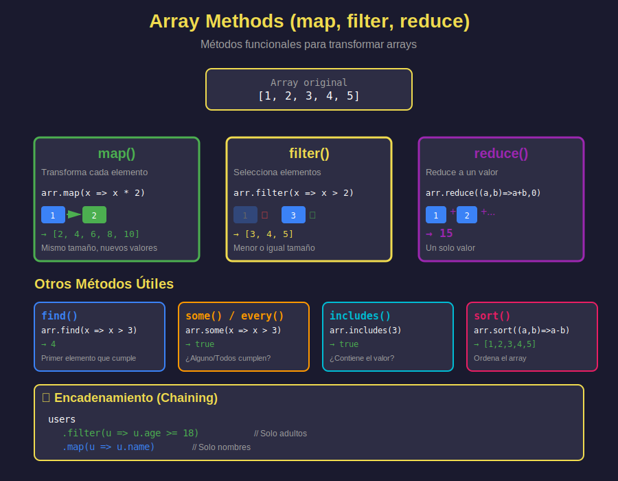

# 🔄 Array Methods (Métodos de Arrays ES2023)



## 🎯 Objetivos

- Dominar `map()`, `filter()`, `reduce()`
- Usar `find()`, `findIndex()`, `some()`, `every()`
- Combinar y encadenar métodos
- Aplicar programación funcional
- Resolver problemas del mundo real

---

## 📖 Introducción

Los métodos modernos de arrays transforman la forma de trabajar con colecciones en JavaScript. Son **inmutables** (no modifican el array original) y siguen un estilo **funcional**.

### Características Clave

- ✅ **Inmutables**: No modifican el array original
- ✅ **Funcionales**: Usan callbacks
- ✅ **Encadenables**: Se pueden combinar
- ✅ **Legibles**: Código más expresivo

---

## 🗺️ map() - Transformar Elementos

**Propósito**: Crear un nuevo array aplicando una función a cada elemento.

### Sintaxis

```javascript
const newArray = array.map((element, index, array) => {
  // Retorna el nuevo valor
});
```

### Ejemplos Básicos

```javascript
// Duplicar números
const numbers = [1, 2, 3, 4, 5];
const doubled = numbers.map(num => num * 2);
console.log(doubled); // [2, 4, 6, 8, 10]
console.log(numbers); // [1, 2, 3, 4, 5] (original intacto)

// Extraer propiedades de objetos
const users = [
  { id: 1, name: 'Ana', age: 25 },
  { id: 2, name: 'Bob', age: 30 },
  { id: 3, name: 'Carlos', age: 35 }
];

const names = users.map(user => user.name);
console.log(names); // ['Ana', 'Bob', 'Carlos']

// Transformar objetos
const updatedUsers = users.map(user => ({
  ...user,
  ageInMonths: user.age * 12
}));
console.log(updatedUsers);
// [{ id: 1, name: 'Ana', age: 25, ageInMonths: 300 }, ...]
```

### Con Índice

```javascript
const letters = ['a', 'b', 'c'];

const withIndex = letters.map((letter, index) => {
  return `${index}: ${letter}`;
});

console.log(withIndex); // ['0: a', '1: b', '2: c']
```

---

## 🔍 filter() - Filtrar Elementos

**Propósito**: Crear un nuevo array solo con elementos que cumplan una condición.

### Sintaxis

```javascript
const newArray = array.filter((element, index, array) => {
  // Retorna true para mantener el elemento
});
```

### Ejemplos Básicos

```javascript
// Números pares
const numbers = [1, 2, 3, 4, 5, 6, 7, 8, 9, 10];
const evens = numbers.filter(num => num % 2 === 0);
console.log(evens); // [2, 4, 6, 8, 10]

// Filtrar por edad
const users = [
  { name: 'Ana', age: 17 },
  { name: 'Bob', age: 25 },
  { name: 'Carlos', age: 30 }
];

const adults = users.filter(user => user.age >= 18);
console.log(adults);
// [{ name: 'Bob', age: 25 }, { name: 'Carlos', age: 30 }]

// Strings con longitud específica
const words = ['cat', 'dog', 'elephant', 'bee'];
const longWords = words.filter(word => word.length > 3);
console.log(longWords); // ['elephant']
```

### Filtros Complejos

```javascript
const products = [
  { name: 'Laptop', price: 999, inStock: true },
  { name: 'Mouse', price: 25, inStock: true },
  { name: 'Keyboard', price: 75, inStock: false },
  { name: 'Monitor', price: 300, inStock: true }
];

// Productos disponibles y baratos
const affordable = products.filter(p => p.inStock && p.price < 100);
console.log(affordable);
// [{ name: 'Mouse', price: 25, inStock: true }]

// Remover valores falsy
const mixed = [0, 1, false, 2, '', 3, null, undefined, 4];
const truthy = mixed.filter(Boolean); // Usa Boolean como callback
console.log(truthy); // [1, 2, 3, 4]
```

---

## ⚡ reduce() - Reducir a un Valor

**Propósito**: Reducir un array a un solo valor (número, string, objeto, array).

### Sintaxis

```javascript
const result = array.reduce((accumulator, current, index, array) => {
  // Retorna el nuevo accumulator
}, initialValue);
```

### Ejemplos Básicos

```javascript
// Suma de números
const numbers = [1, 2, 3, 4, 5];
const sum = numbers.reduce((total, num) => total + num, 0);
console.log(sum); // 15

// Producto
const product = numbers.reduce((acc, num) => acc * num, 1);
console.log(product); // 120

// Concatenar strings
const words = ['Hello', 'from', 'reduce'];
const sentence = words.reduce((acc, word) => `${acc} ${word}`, '');
console.log(sentence); // ' Hello from reduce'
```

### Casos Avanzados

```javascript
// Contar ocurrencias
const fruits = ['apple', 'banana', 'apple', 'orange', 'banana', 'apple'];

const count = fruits.reduce((acc, fruit) => {
  acc[fruit] = (acc[fruit] || 0) + 1;
  return acc;
}, {});

console.log(count);
// { apple: 3, banana: 2, orange: 1 }

// Agrupar por propiedad
const users = [
  { name: 'Ana', role: 'admin' },
  { name: 'Bob', role: 'user' },
  { name: 'Carlos', role: 'admin' },
  { name: 'Diana', role: 'user' }
];

const grouped = users.reduce((acc, user) => {
  const key = user.role;
  if (!acc[key]) acc[key] = [];
  acc[key].push(user);
  return acc;
}, {});

console.log(grouped);
// { admin: [{...}, {...}], user: [{...}, {...}] }

// Aplanar array
const nested = [[1, 2], [3, 4], [5, 6]];
const flat = nested.reduce((acc, arr) => acc.concat(arr), []);
console.log(flat); // [1, 2, 3, 4, 5, 6]

// Calcular total de carrito
const cart = [
  { name: 'Product A', price: 100, quantity: 2 },
  { name: 'Product B', price: 50, quantity: 3 },
  { name: 'Product C', price: 75, quantity: 1 }
];

const total = cart.reduce((sum, item) => {
  return sum + (item.price * item.quantity);
}, 0);

console.log(total); // 425
```

---

## 🔎 find() y findIndex()

### find() - Encontrar Elemento

**Propósito**: Retorna el **primer elemento** que cumple la condición (o `undefined`).

```javascript
const users = [
  { id: 1, name: 'Ana' },
  { id: 2, name: 'Bob' },
  { id: 3, name: 'Carlos' }
];

const user = users.find(u => u.id === 2);
console.log(user); // { id: 2, name: 'Bob' }

const notFound = users.find(u => u.id === 99);
console.log(notFound); // undefined

// Encontrar número par
const numbers = [1, 3, 5, 8, 9];
const firstEven = numbers.find(n => n % 2 === 0);
console.log(firstEven); // 8
```

### findIndex() - Encontrar Índice

**Propósito**: Retorna el **índice** del primer elemento que cumple la condición (o `-1`).

```javascript
const users = [
  { id: 1, name: 'Ana' },
  { id: 2, name: 'Bob' },
  { id: 3, name: 'Carlos' }
];

const index = users.findIndex(u => u.id === 2);
console.log(index); // 1

const notFound = users.findIndex(u => u.id === 99);
console.log(notFound); // -1

// Uso: Actualizar elemento
const updateUser = (users, id, updates) => {
  const index = users.findIndex(u => u.id === id);
  if (index === -1) return users;

  return [
    ...users.slice(0, index),
    { ...users[index], ...updates },
    ...users.slice(index + 1)
  ];
};

const updated = updateUser(users, 2, { name: 'Bobby' });
console.log(updated);
// [{ id: 1, name: 'Ana' }, { id: 2, name: 'Bobby' }, { id: 3, name: 'Carlos' }]
```

---

## ✅ some() y every()

### some() - ¿Alguno cumple?

**Propósito**: Retorna `true` si **al menos un elemento** cumple la condición.

```javascript
const numbers = [1, 2, 3, 4, 5];

const hasEven = numbers.some(n => n % 2 === 0);
console.log(hasEven); // true

const hasNegative = numbers.some(n => n < 0);
console.log(hasNegative); // false

// Verificar disponibilidad
const products = [
  { name: 'A', inStock: false },
  { name: 'B', inStock: true },
  { name: 'C', inStock: false }
];

const anyAvailable = products.some(p => p.inStock);
console.log(anyAvailable); // true
```

### every() - ¿Todos cumplen?

**Propósito**: Retorna `true` si **todos los elementos** cumplen la condición.

```javascript
const numbers = [2, 4, 6, 8];

const allEven = numbers.every(n => n % 2 === 0);
console.log(allEven); // true

const allPositive = numbers.every(n => n > 0);
console.log(allPositive); // true

const allLarge = numbers.every(n => n > 5);
console.log(allLarge); // false

// Validar formulario
const formFields = [
  { name: 'email', value: 'user@example.com', valid: true },
  { name: 'password', value: '12345', valid: false },
  { name: 'name', value: 'John', valid: true }
];

const formValid = formFields.every(field => field.valid);
console.log(formValid); // false
```

---

## ⛓️ Encadenamiento (Chaining)

Combinar múltiples métodos para operaciones complejas:

```javascript
const users = [
  { name: 'Ana', age: 17, active: true },
  { name: 'Bob', age: 25, active: true },
  { name: 'Carlos', age: 30, active: false },
  { name: 'Diana', age: 22, active: true },
  { name: 'Eva', age: 35, active: true }
];

// Filtrar adultos activos, obtener nombres, convertir a mayúsculas
const result = users
  .filter(user => user.age >= 18)      // Adultos
  .filter(user => user.active)         // Activos
  .map(user => user.name)              // Solo nombres
  .map(name => name.toUpperCase());    // Mayúsculas

console.log(result); // ['BOB', 'DIANA', 'EVA']

// Ejemplo complejo: Reporte de ventas
const sales = [
  { product: 'Laptop', amount: 999, quantity: 2, category: 'electronics' },
  { product: 'Mouse', amount: 25, quantity: 5, category: 'electronics' },
  { product: 'Desk', amount: 200, quantity: 1, category: 'furniture' },
  { product: 'Chair', amount: 150, quantity: 4, category: 'furniture' }
];

const electronicsTotal = sales
  .filter(sale => sale.category === 'electronics')
  .map(sale => sale.amount * sale.quantity)
  .reduce((sum, total) => sum + total, 0);

console.log(electronicsTotal); // 2123
```

---

## 💼 Casos de Uso Reales

### 1. Búsqueda y Filtrado

```javascript
const products = [
  { id: 1, name: 'Laptop Dell', price: 999, category: 'electronics' },
  { id: 2, name: 'Mouse Logitech', price: 25, category: 'electronics' },
  { id: 3, name: 'Desk Oak', price: 200, category: 'furniture' },
  { id: 4, name: 'Monitor Samsung', price: 300, category: 'electronics' }
];

const searchProducts = (products, query, filters = {}) => {
  return products
    .filter(p => {
      // Búsqueda por texto
      const matchesQuery = query
        ? p.name.toLowerCase().includes(query.toLowerCase())
        : true;

      // Filtro por categoría
      const matchesCategory = filters.category
        ? p.category === filters.category
        : true;

      // Filtro por precio
      const matchesPrice = filters.maxPrice
        ? p.price <= filters.maxPrice
        : true;

      return matchesQuery && matchesCategory && matchesPrice;
    });
};

const results = searchProducts(products, 'monitor', {
  category: 'electronics',
  maxPrice: 500
});

console.log(results);
// [{ id: 4, name: 'Monitor Samsung', ... }]
```

### 2. Transformación de Datos para UI

```javascript
const apiResponse = [
  { userId: 1, firstName: 'Ana', lastName: 'García', emailAddress: 'ana@example.com' },
  { userId: 2, firstName: 'Bob', lastName: 'Smith', emailAddress: 'bob@example.com' }
];

// Transformar para componente de UI
const uiData = apiResponse.map(user => ({
  id: user.userId,
  fullName: `${user.firstName} ${user.lastName}`,
  email: user.emailAddress,
  initials: `${user.firstName[0]}${user.lastName[0]}`
}));

console.log(uiData);
// [{ id: 1, fullName: 'Ana García', email: '...', initials: 'AG' }, ...]
```

### 3. Estadísticas

```javascript
const grades = [85, 90, 78, 92, 88, 76, 95, 89];

const stats = {
  average: grades.reduce((sum, g) => sum + g, 0) / grades.length,
  max: Math.max(...grades),
  min: Math.min(...grades),
  passed: grades.filter(g => g >= 70).length,
  failed: grades.filter(g => g < 70).length,
  excellent: grades.filter(g => g >= 90).length
};

console.log(stats);
// { average: 86.625, max: 95, min: 76, passed: 8, failed: 0, excellent: 3 }
```

---

## 🎯 Ejercicios Prácticos

### Ejercicio 1: Nombres Mayores de Edad

```javascript
const people = [
  { name: 'Ana', age: 17 },
  { name: 'Bob', age: 25 },
  { name: 'Carlos', age: 30 },
  { name: 'Diana', age: 16 }
];

// Obtén array de nombres de personas >= 18
const adultNames = // ???

console.log(adultNames); // ['Bob', 'Carlos']
```

### Ejercicio 2: Precio Total

```javascript
const items = [
  { name: 'Book', price: 15, quantity: 2 },
  { name: 'Pen', price: 2, quantity: 5 },
  { name: 'Notebook', price: 5, quantity: 3 }
];

// Calcula el total (price * quantity) de todos los items
const total = // ???

console.log(total); // 55
```

### Ejercicio 3: Encontrar Usuario

```javascript
const users = [
  { id: 1, username: 'ana123', email: 'ana@example.com' },
  { id: 2, username: 'bob456', email: 'bob@example.com' },
  { id: 3, username: 'carlos789', email: 'carlos@example.com' }
];

// Encuentra el usuario con username 'bob456'
const user = // ???

console.log(user); // { id: 2, username: 'bob456', ... }
```

---

## ✅ Soluciones

<details>
<summary>Ver Soluciones</summary>

```javascript
// Ejercicio 1
const adultNames = people
  .filter(person => person.age >= 18)
  .map(person => person.name);

// Ejercicio 2
const total = items.reduce((sum, item) => {
  return sum + (item.price * item.quantity);
}, 0);

// Ejercicio 3
const user = users.find(u => u.username === 'bob456');
```
</details>

---

## 📊 Comparativa de Métodos

| Método        | Retorna                     | Modifica Original | Uso Principal         |
| ------------- | --------------------------- | ----------------- | --------------------- |
| `map()`       | Nuevo array (mismo tamaño)  | ❌ No              | Transformar elementos |
| `filter()`    | Nuevo array (menor o igual) | ❌ No              | Filtrar elementos     |
| `reduce()`    | Cualquier valor             | ❌ No              | Reducir a un valor    |
| `find()`      | Elemento o undefined        | ❌ No              | Encontrar un elemento |
| `findIndex()` | Número (índice o -1)        | ❌ No              | Encontrar posición    |
| `some()`      | Boolean                     | ❌ No              | ¿Alguno cumple?       |
| `every()`     | Boolean                     | ❌ No              | ¿Todos cumplen?       |

---

## 🎓 Conceptos Clave

- **Inmutabilidad**: Métodos NO modifican el array original
- **Callbacks**: Funciones que se ejecutan para cada elemento
- **Chaining**: Encadenar métodos para operaciones complejas
- **Programación Funcional**: Estilo declarativo vs imperativo

---

## 📚 Recursos Adicionales

- [MDN - Array](https://developer.mozilla.org/es/docs/Web/JavaScript/Reference/Global_Objects/Array)
- [JavaScript.info - Array methods](https://javascript.info/array-methods)

---

## 🔗 Navegación

- [← Anterior: Default Parameters](03-default-parameters.md)
- [→ Siguiente: Object Enhancements](05-object-enhancements.md)
- [↑ Volver al README](../README.md)

---

_Semana 02 - JavaScript Moderno Bootcamp_
