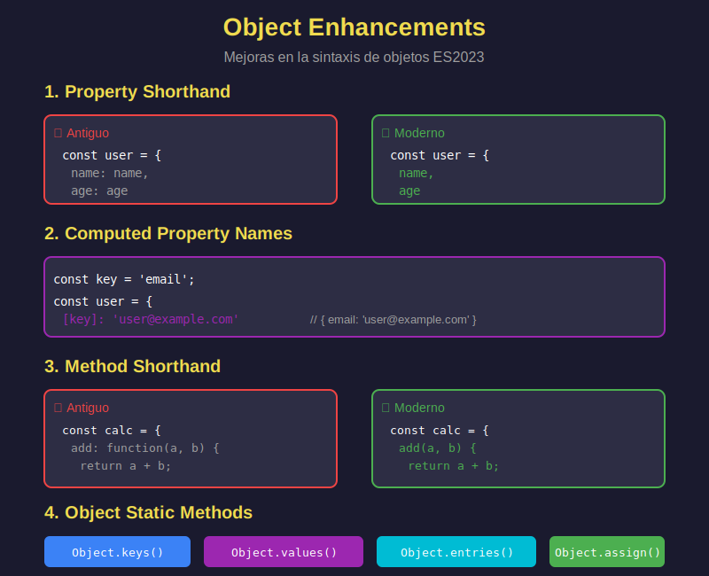

# ✨ Object Enhancements (Mejoras de Objetos ES2023)



## 🎯 Objetivos

- Usar property shorthand (sintaxis abreviada)
- Crear computed property names (propiedades computadas)
- Definir métodos con sintaxis moderna
- Aplicar Object.assign(), Object.keys(), Object.values(), Object.entries()
- Dominar object spread para inmutabilidad

---

## 📖 Introducción

ES2023 introdujo mejoras significativas en la sintaxis de objetos, haciendo el código más conciso y expresivo.

---

## 🎯 Property Shorthand (Sintaxis Abreviada)

Cuando el nombre de la propiedad y la variable son iguales:

```javascript
// ❌ ANTIGUO: Repetir el nombre
const name = 'Ana';
const age = 25;

const userOld = {
  name: name,
  age: age
};

// ✅ MODERNO: Shorthand
const user = {
  name,
  age
};

console.log(user); // { name: 'Ana', age: 25 }
```

### Ejemplo Práctico

```javascript
const createProduct = (id, name, price) => {
  return {
    id,
    name,
    price,
    createdAt: new Date()
  };
};

const product = createProduct(1, 'Laptop', 999);
console.log(product);
// { id: 1, name: 'Laptop', price: 999, createdAt: Date }

// Desestructurar y reconstruir
const user = { id: 1, name: 'Bob', email: 'bob@example.com', age: 30 };
const { email, ...rest } = user;

const publicUser = {
  ...rest,
  verified: true
};

console.log(publicUser);
// { id: 1, name: 'Bob', age: 30, verified: true }
```

---

## 🧮 Computed Property Names (Propiedades Computadas)

Usar expresiones dinámicas como nombres de propiedades:

```javascript
// ❌ ANTIGUO: Crear primero, luego asignar
const key = 'color';
const obj = {};
obj[key] = 'blue';

// ✅ MODERNO: Directamente en el literal
const color = 'blue';
const obj = {
  [key]: color
};

console.log(obj); // { color: 'blue' }
```

### Casos de Uso

```javascript
// 1. Propiedades dinámicas
const createField = (fieldName, value) => {
  return {
    [fieldName]: value,
    [`${fieldName}Valid`]: value !== ''
  };
};

console.log(createField('email', 'user@example.com'));
// { email: 'user@example.com', emailValid: true }

// 2. Eventos dinámicos
const eventType = 'click';
const handlers = {
  [`on${eventType.charAt(0).toUpperCase()}${eventType.slice(1)}`]: () => {
    console.log('Clicked!');
  }
};

console.log(handlers); // { onClick: [Function] }

// 3. Mapear array a objeto
const users = [
  { id: 1, name: 'Ana' },
  { id: 2, name: 'Bob' }
];

const usersById = users.reduce((acc, user) => {
  return {
    ...acc,
    [user.id]: user
  };
}, {});

console.log(usersById);
// { 1: { id: 1, name: 'Ana' }, 2: { id: 2, name: 'Bob' } }

// 4. Configuración con prefijos
const createConfig = (env) => {
  return {
    [`${env}_API_URL`]: `https://${env}.api.com`,
    [`${env}_TIMEOUT`]: env === 'production' ? 5000 : 10000
  };
};

console.log(createConfig('dev'));
// { dev_API_URL: 'https://dev.api.com', dev_TIMEOUT: 10000 }
```

---

## 🛠️ Method Shorthand (Métodos Abreviados)

### Sintaxis Moderna de Métodos

```javascript
// ❌ ANTIGUO: Función como propiedad
const calculator = {
  add: function(a, b) {
    return a + b;
  },
  subtract: function(a, b) {
    return a - b;
  }
};

// ✅ MODERNO: Method shorthand
const calculator = {
  add(a, b) {
    return a + b;
  },
  subtract(a, b) {
    return a - b;
  }
};

console.log(calculator.add(5, 3)); // 8

// ⚠️ NOTA: Arrow functions NO funcionan como métodos
const obj = {
  name: 'Test',
  // ❌ 'this' NO apunta al objeto
  greet: () => {
    console.log(this.name); // undefined
  },
  // ✅ Usar method shorthand
  greetCorrect() {
    console.log(this.name); // 'Test'
  }
};
```

### Ejemplo Completo

```javascript
const user = {
  firstName: 'Ana',
  lastName: 'García',
  age: 25,

  // Getter usando method shorthand
  getFullName() {
    return `${this.firstName} ${this.lastName}`;
  },

  // Método con lógica
  celebrateBirthday() {
    this.age++;
    return `Happy birthday! You are now ${this.age}`;
  },

  // Método que retorna objeto
  toJSON() {
    return {
      fullName: this.getFullName(),
      age: this.age
    };
  }
};

console.log(user.getFullName());       // 'Ana García'
console.log(user.celebrateBirthday()); // 'Happy birthday! You are now 26'
console.log(user.toJSON());            // { fullName: '...', age: 26 }
```

---

## 🔧 Object Methods (Métodos Estáticos)

### Object.assign() - Fusionar Objetos

```javascript
// Combinar objetos
const defaults = { theme: 'dark', lang: 'en' };
const userPrefs = { lang: 'es' };

const config = Object.assign({}, defaults, userPrefs);
console.log(config); // { theme: 'dark', lang: 'es' }

// ✅ MEJOR: Usar spread operator
const config2 = { ...defaults, ...userPrefs };
console.log(config2); // { theme: 'dark', lang: 'es' }

// Clonar objeto (shallow)
const original = { a: 1, b: 2 };
const clone = Object.assign({}, original);
console.log(clone); // { a: 1, b: 2 }
```

### Object.keys() - Array de Claves

```javascript
const user = {
  id: 1,
  name: 'Ana',
  email: 'ana@example.com'
};

const keys = Object.keys(user);
console.log(keys); // ['id', 'name', 'email']

// Iterar sobre propiedades
Object.keys(user).forEach(key => {
  console.log(`${key}: ${user[key]}`);
});
// id: 1
// name: Ana
// email: ana@example.com
```

### Object.values() - Array de Valores

```javascript
const scores = {
  math: 90,
  english: 85,
  science: 92
};

const values = Object.values(scores);
console.log(values); // [90, 85, 92]

// Calcular promedio
const average = values.reduce((a, b) => a + b, 0) / values.length;
console.log(average); // 89
```

### Object.entries() - Array de Pares [clave, valor]

```javascript
const user = {
  name: 'Ana',
  age: 25,
  city: 'Madrid'
};

const entries = Object.entries(user);
console.log(entries);
// [['name', 'Ana'], ['age', 25], ['city', 'Madrid']]

// Filtrar propiedades
const filtered = Object.entries(user)
  .filter(([key, value]) => typeof value === 'string')
  .reduce((obj, [key, value]) => {
    obj[key] = value;
    return obj;
  }, {});

console.log(filtered); // { name: 'Ana', city: 'Madrid' }

// Convertir a Map
const map = new Map(Object.entries(user));
console.log(map.get('name')); // 'Ana'
```

### Object.fromEntries() - De Pares a Objeto

```javascript
// Inverso de Object.entries()
const entries = [
  ['name', 'Ana'],
  ['age', 25]
];

const obj = Object.fromEntries(entries);
console.log(obj); // { name: 'Ana', age: 25 }

// Transformar objeto
const prices = {
  laptop: 999,
  mouse: 25,
  keyboard: 75
};

const discounted = Object.fromEntries(
  Object.entries(prices).map(([name, price]) => [name, price * 0.9])
);

console.log(discounted);
// { laptop: 899.1, mouse: 22.5, keyboard: 67.5 }

// Filtrar objeto
const user = {
  id: 1,
  name: 'Ana',
  password: 'secret',
  email: 'ana@example.com'
};

const publicUser = Object.fromEntries(
  Object.entries(user).filter(([key]) => key !== 'password')
);

console.log(publicUser);
// { id: 1, name: 'Ana', email: 'ana@example.com' }
```

---

## 🔄 Object Spread para Inmutabilidad

### Clonar y Actualizar

```javascript
const user = {
  id: 1,
  name: 'Ana',
  email: 'ana@example.com'
};

// Actualizar sin mutar
const updatedUser = {
  ...user,
  email: 'newemail@example.com'
};

console.log(user);        // Original intacto
console.log(updatedUser); // Con email nuevo

// Añadir propiedades
const userWithRole = {
  ...user,
  role: 'admin',
  verified: true
};

console.log(userWithRole);
// { id: 1, name: 'Ana', email: '...', role: 'admin', verified: true }
```

### Fusionar Objetos

```javascript
const defaults = {
  theme: 'dark',
  fontSize: 14,
  notifications: true
};

const userSettings = {
  theme: 'light',
  fontSize: 16
};

const settings = {
  ...defaults,
  ...userSettings
};

console.log(settings);
// { theme: 'light', fontSize: 16, notifications: true }
```

### Remover Propiedades

```javascript
const user = {
  id: 1,
  name: 'Ana',
  password: 'secret123',
  email: 'ana@example.com'
};

// Remover password
const { password, ...safeUser } = user;

console.log(safeUser);
// { id: 1, name: 'Ana', email: 'ana@example.com' }

// Remover múltiples
const { password: _, email: __, ...minimal } = user;
console.log(minimal); // { id: 1, name: 'Ana' }
```

---

## 💼 Casos de Uso Reales

### 1. API Response Transformer

```javascript
const transformUser = (apiUser) => {
  const {
    user_id: id,
    first_name,
    last_name,
    email_address: email,
    ...rest
  } = apiUser;

  return {
    id,
    fullName: `${first_name} ${last_name}`,
    email,
    ...rest
  };
};

const apiResponse = {
  user_id: 1,
  first_name: 'Ana',
  last_name: 'García',
  email_address: 'ana@example.com',
  created_at: '2024-01-15'
};

console.log(transformUser(apiResponse));
// { id: 1, fullName: 'Ana García', email: '...', created_at: '...' }
```

### 2. Form State Manager

```javascript
const createFormState = (fields) => {
  return Object.fromEntries(
    fields.map(field => [
      field,
      { value: '', error: null, touched: false }
    ])
  );
};

const formState = createFormState(['email', 'password', 'name']);
console.log(formState);
// { email: { value: '', error: null, touched: false }, ... }

// Actualizar field
const updateField = (state, fieldName, updates) => {
  return {
    ...state,
    [fieldName]: {
      ...state[fieldName],
      ...updates
    }
  };
};

const updated = updateField(formState, 'email', {
  value: 'ana@example.com',
  touched: true
});
```

### 3. Redux-style Reducer

```javascript
const initialState = {
  users: [],
  loading: false,
  error: null
};

const userReducer = (state = initialState, action) => {
  switch (action.type) {
    case 'FETCH_START':
      return {
        ...state,
        loading: true,
        error: null
      };

    case 'FETCH_SUCCESS':
      return {
        ...state,
        loading: false,
        users: action.payload
      };

    case 'FETCH_ERROR':
      return {
        ...state,
        loading: false,
        error: action.payload
      };

    default:
      return state;
  }
};
```

### 4. Query String Builder

```javascript
const buildQueryString = (params) => {
  const filtered = Object.fromEntries(
    Object.entries(params).filter(([_, value]) => value != null)
  );

  return Object.entries(filtered)
    .map(([key, value]) => `${key}=${encodeURIComponent(value)}`)
    .join('&');
};

const params = {
  search: 'laptop',
  category: 'electronics',
  minPrice: null,
  maxPrice: 1000,
  page: 1
};

console.log(buildQueryString(params));
// 'search=laptop&category=electronics&maxPrice=1000&page=1'
```

---

## 🎯 Ejercicios Prácticos

### Ejercicio 1: Crear Usuario

```javascript
// Usa shorthand para crear un objeto
const name = 'Ana';
const age = 25;
const email = 'ana@example.com';

const user = // ???

console.log(user);
// { name: 'Ana', age: 25, email: 'ana@example.com' }
```

### Ejercicio 2: Sumar Valores

```javascript
const scores = {
  math: 90,
  english: 85,
  science: 92,
  history: 88
};

// Suma todos los valores del objeto
const total = // ???

console.log(total); // 355
```

### Ejercicio 3: Actualizar Inmutablemente

```javascript
const product = {
  id: 1,
  name: 'Laptop',
  price: 999,
  stock: 5
};

// Crea nuevo objeto con stock: 4 sin mutar original
const updated = // ???

console.log(product.stock); // 5 (original intacto)
console.log(updated.stock); // 4 (nuevo objeto)
```

---

## ✅ Soluciones

<details>
<summary>Ver Soluciones</summary>

```javascript
// Ejercicio 1
const user = { name, age, email };

// Ejercicio 2
const total = Object.values(scores).reduce((sum, score) => sum + score, 0);

// Ejercicio 3
const updated = { ...product, stock: 4 };
```
</details>

---

## 📊 Resumen de Métodos

| Método                 | Entrada        | Salida           | Uso                     |
| ---------------------- | -------------- | ---------------- | ----------------------- |
| `Object.keys()`        | Objeto         | Array de strings | Obtener claves          |
| `Object.values()`      | Objeto         | Array de valores | Obtener valores         |
| `Object.entries()`     | Objeto         | Array de pares   | Iterar key-value        |
| `Object.fromEntries()` | Array de pares | Objeto           | Crear objeto            |
| `Object.assign()`      | Objetos        | Objeto           | Fusionar (muta destino) |

---

## 🎓 Conceptos Clave

- **Property Shorthand**: `{ name }` en vez de `{ name: name }`
- **Computed Properties**: `{ [key]: value }`
- **Method Shorthand**: `{ method() {} }`
- **Object Spread**: Clonado y fusión inmutable
- **Object Methods**: keys, values, entries, fromEntries

---

## 📚 Recursos Adicionales

- [MDN - Working with Objects](https://developer.mozilla.org/es/docs/Web/JavaScript/Guide/Working_with_Objects)
- [MDN - Object](https://developer.mozilla.org/es/docs/Web/JavaScript/Reference/Global_Objects/Object)

---

## 🔗 Navegación

- [← Anterior: Array Methods](04-array-methods.md)
- [↑ Volver al README](../README.md)

---

_Semana 02 - JavaScript Moderno Bootcamp_
