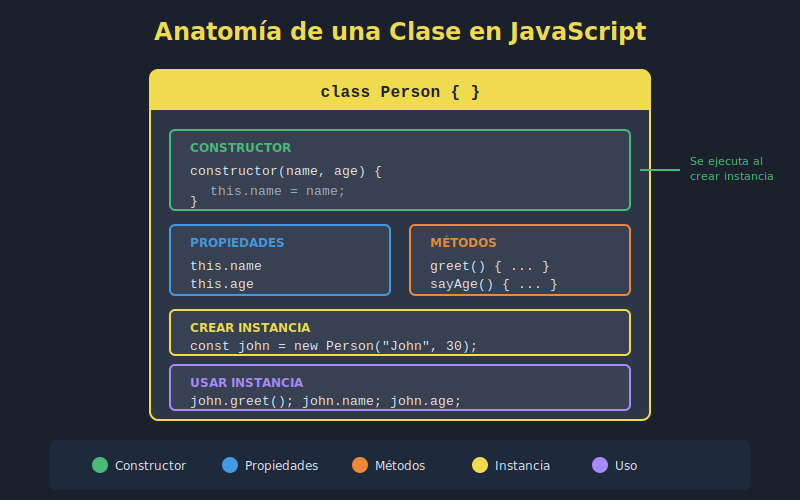
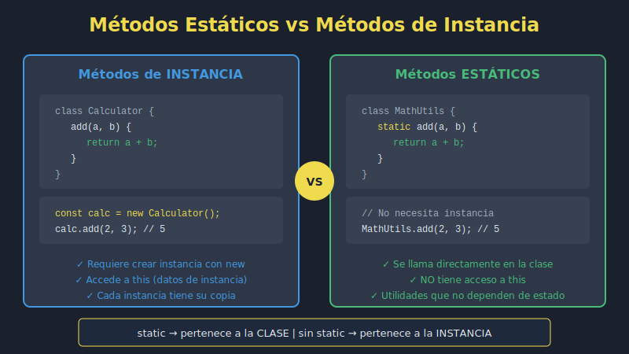

# 📁 Assets - Semana 3

## 📊 Recursos Visuales

Esta carpeta contiene los diagramas SVG para la **Semana 3: Clases y Programación Orientada a Objetos**.

---

## 🗂️ Archivos Incluidos

| # | Archivo | Descripción | Tema |
|---|---------|-------------|------|
| 1 | `01-clases-basicas.svg` | Anatomía de una clase ES2023 | Constructor, propiedades, métodos |
| 2 | `02-metodos-estaticos.svg` | Comparativa static vs instancia | Cuándo usar cada tipo |
| 3 | `03-herencia.svg` | Cadena de herencia | extends, super |
| 4 | `04-getters-setters.svg` | Propiedades computadas | get, set, validación |
| 5 | `05-campos-privados.svg` | Encapsulación con # | Campos y métodos privados |

---

## 🎨 Estándares de Diseño

### Formato
- ✅ **SVG** para todos los diagramas
- ✅ **Tema dark** obligatorio
- ❌ **Sin degradados** (gradients)
- ✅ **Fuentes sans-serif** (system-ui, sans-serif)
- ✅ **Código en Courier/monospace**

### Dimensiones
- **ViewBox**: 800×400 a 800×600 píxeles
- **Responsive**: Escalan proporcionalmente

---

## 🎨 Paleta de Colores

| Color | Hex | Uso |
|-------|-----|-----|
| 🟡 Amarillo JS | `#f0db4f` | Acento principal, títulos destacados |
| ⬛ Fondo | `#1a202c` | Background principal |
| 🔲 Contenedor | `#2d3748` | Cajas y contenedores |
| 🔳 Código | `#374151` | Bloques de código |
| ⬜ Texto | `#e2e8f0` | Texto principal |
| 🔘 Texto Sec | `#a0aec0` | Texto secundario, comentarios |
| 🟢 Success | `#48bb78` | Correcto, moderno, público |
| 🔵 Info | `#4299e1` | Información, instancia |
| 🟠 Warning | `#ed8936` | Atención, setter |
| 🔴 Error | `#ef4444` | Incorrecto, privado |
| 🟣 Accent | `#a78bfa` | Destacado adicional |

---

## 📖 Uso en Documentación

### Insertar en Markdown

```markdown



```

### Insertar en HTML

```html


<object data="0-assets/04-getters-setters.svg" type="image/svg+xml"></object>
```

---

## ✅ Checklist de Assets

- [x] 01-clases-basicas.svg - Anatomía de clase
- [x] 02-metodos-estaticos.svg - Static vs instancia
- [x] 03-herencia.svg - Herencia (extends/super)
- [x] 04-getters-setters.svg - Propiedades computadas
- [x] 05-campos-privados.svg - Encapsulación

---

## 🔗 Referencias

- [SVG MDN Documentation](https://developer.mozilla.org/es/docs/Web/SVG)
- [JavaScript Info - Classes](https://javascript.info/classes)
- [Semana 3 - Teoría](../1-teoria/)

---

_Última actualización: Semana 3 - Clases y POO_
