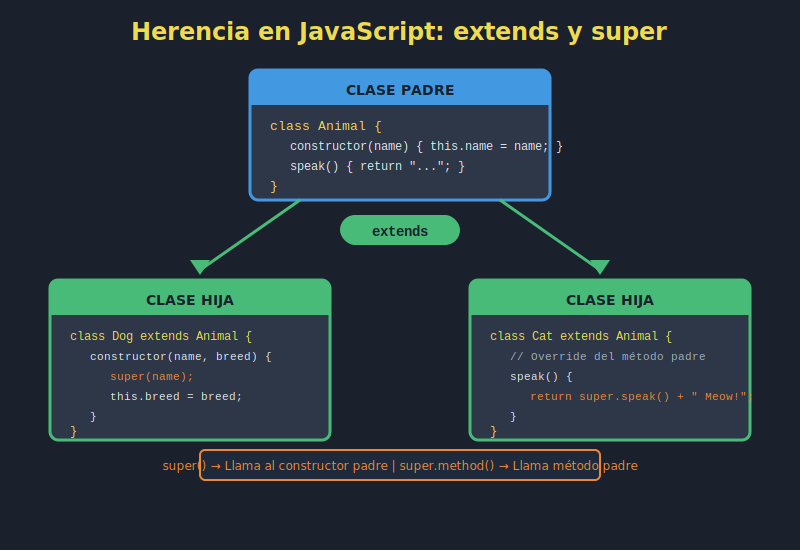

# 📘 Herencia en JavaScript ES2023

## 🎯 Objetivos

- Comprender el concepto de herencia en POO
- Usar `extends` para crear clases hijas
- Utilizar `super` para acceder a la clase padre
- Sobrescribir métodos (method overriding)
- Aplicar polimorfismo en JavaScript

---

## �️ Diagrama



---

## �📋 Contenido

### 1. ¿Qué es la Herencia?

La herencia permite crear nuevas clases basadas en clases existentes, reutilizando código y estableciendo relaciones jerárquicas.

```javascript
// Clase base (padre)
class Animal {
  constructor(name) {
    this.name = name;
  }

  speak() {
    return `${this.name} makes a sound`;
  }

  move() {
    return `${this.name} is moving`;
  }
}

// Clase derivada (hija)
class Dog extends Animal {
  constructor(name, breed) {
    super(name); // Llama al constructor del padre
    this.breed = breed;
  }

  // Sobrescribe el método speak
  speak() {
    return `${this.name} barks: Woof!`;
  }

  // Método propio de Dog
  fetch() {
    return `${this.name} is fetching the ball`;
  }
}

const dog = new Dog('Max', 'Labrador');
console.log(dog.speak()); // "Max barks: Woof!"
console.log(dog.move());  // "Max is moving" (heredado)
console.log(dog.fetch()); // "Max is fetching the ball"
```

### 2. La Palabra Clave `extends`

`extends` establece la relación de herencia entre dos clases:

```javascript
class Vehicle {
  constructor(brand, model) {
    this.brand = brand;
    this.model = model;
    this.isRunning = false;
  }

  start() {
    this.isRunning = true;
    return `${this.brand} ${this.model} started`;
  }

  stop() {
    this.isRunning = false;
    return `${this.brand} ${this.model} stopped`;
  }

  getInfo() {
    return `${this.brand} ${this.model}`;
  }
}

class Car extends Vehicle {
  constructor(brand, model, doors) {
    super(brand, model);
    this.doors = doors;
    this.gear = 'P';
  }

  shift(gear) {
    const validGears = ['P', 'R', 'N', 'D'];
    if (validGears.includes(gear)) {
      this.gear = gear;
      return `Shifted to ${gear}`;
    }
    throw new Error('Invalid gear');
  }
}

class Motorcycle extends Vehicle {
  constructor(brand, model, type) {
    super(brand, model);
    this.type = type; // 'sport', 'cruiser', 'touring'
  }

  wheelie() {
    if (!this.isRunning) {
      return 'Start the motorcycle first!';
    }
    return `${this.getInfo()} is doing a wheelie! 🏍️`;
  }
}

const car = new Car('Toyota', 'Camry', 4);
const bike = new Motorcycle('Harley-Davidson', 'Sportster', 'cruiser');

console.log(car.start());    // "Toyota Camry started"
console.log(car.shift('D')); // "Shifted to D"
console.log(bike.start());   // "Harley-Davidson Sportster started"
console.log(bike.wheelie()); // "Harley-Davidson Sportster is doing a wheelie! 🏍️"
```

### 3. La Palabra Clave `super`

`super` tiene dos usos principales:

#### 3.1 En el Constructor

```javascript
class Person {
  constructor(name, age) {
    this.name = name;
    this.age = age;
  }
}

class Employee extends Person {
  constructor(name, age, position, salary) {
    // DEBE llamarse antes de usar 'this'
    super(name, age);

    // Ahora podemos usar 'this'
    this.position = position;
    this.salary = salary;
    this.hireDate = new Date();
  }
}

const employee = new Employee('Ana', 30, 'Developer', 75000);
console.log(employee.name);     // "Ana"
console.log(employee.position); // "Developer"
```

#### 3.2 Para Llamar Métodos del Padre

```javascript
class Shape {
  constructor(color) {
    this.color = color;
  }

  describe() {
    return `A ${this.color} shape`;
  }

  getArea() {
    return 0; // Base implementation
  }
}

class Circle extends Shape {
  constructor(color, radius) {
    super(color);
    this.radius = radius;
  }

  // Sobrescribe y extiende el método padre
  describe() {
    // Llama al método del padre
    const baseDescription = super.describe();
    return `${baseDescription} - Circle with radius ${this.radius}`;
  }

  getArea() {
    return Math.PI * this.radius ** 2;
  }
}

class Rectangle extends Shape {
  constructor(color, width, height) {
    super(color);
    this.width = width;
    this.height = height;
  }

  describe() {
    return `${super.describe()} - Rectangle ${this.width}x${this.height}`;
  }

  getArea() {
    return this.width * this.height;
  }
}

const circle = new Circle('red', 5);
const rect = new Rectangle('blue', 4, 6);

console.log(circle.describe()); // "A red shape - Circle with radius 5"
console.log(circle.getArea());  // 78.54...
console.log(rect.describe());   // "A blue shape - Rectangle 4x6"
console.log(rect.getArea());    // 24
```

### 4. Sobrescritura de Métodos (Method Overriding)

La clase hija puede redefinir métodos de la clase padre:

```javascript
class Notification {
  constructor(message) {
    this.message = message;
    this.timestamp = new Date();
  }

  send() {
    console.log(`[${this.timestamp.toISOString()}] ${this.message}`);
  }

  format() {
    return this.message;
  }
}

class EmailNotification extends Notification {
  constructor(message, recipient, subject) {
    super(message);
    this.recipient = recipient;
    this.subject = subject;
  }

  // Sobrescribe completamente
  send() {
    console.log(`📧 Sending email to: ${this.recipient}`);
    console.log(`   Subject: ${this.subject}`);
    console.log(`   Body: ${this.message}`);
  }

  format() {
    return `To: ${this.recipient}\nSubject: ${this.subject}\n\n${this.message}`;
  }
}

class SMSNotification extends Notification {
  constructor(message, phoneNumber) {
    super(message);
    this.phoneNumber = phoneNumber;
  }

  send() {
    // Truncar mensaje para SMS
    const truncated = this.message.slice(0, 160);
    console.log(`📱 SMS to ${this.phoneNumber}: ${truncated}`);
  }
}

class PushNotification extends Notification {
  constructor(message, title, icon = '🔔') {
    super(message);
    this.title = title;
    this.icon = icon;
  }

  send() {
    console.log(`${this.icon} ${this.title}`);
    console.log(`   ${this.message}`);
  }
}

// Uso polimórfico
const notifications = [
  new EmailNotification('Meeting tomorrow', 'ana@email.com', 'Reminder'),
  new SMSNotification('Your code is 123456', '+1234567890'),
  new PushNotification('New message received', 'Chat App', '💬')
];

notifications.forEach(n => n.send());
```

### 5. Polimorfismo

El polimorfismo permite tratar objetos de diferentes clases de manera uniforme:

```javascript
class PaymentMethod {
  constructor(name) {
    this.name = name;
  }

  process(amount) {
    throw new Error('Method process() must be implemented');
  }

  validate() {
    return true;
  }
}

class CreditCard extends PaymentMethod {
  constructor(cardNumber, cvv, expiry) {
    super('Credit Card');
    this.cardNumber = cardNumber;
    this.cvv = cvv;
    this.expiry = expiry;
  }

  process(amount) {
    if (!this.validate()) {
      throw new Error('Invalid card');
    }
    const last4 = this.cardNumber.slice(-4);
    return `Charged $${amount} to card ending in ${last4}`;
  }

  validate() {
    // Validación básica de Luhn (simplificada)
    return this.cardNumber.length === 16 && this.cvv.length === 3;
  }
}

class PayPal extends PaymentMethod {
  constructor(email) {
    super('PayPal');
    this.email = email;
  }

  process(amount) {
    return `Sent $${amount} via PayPal to ${this.email}`;
  }
}

class Crypto extends PaymentMethod {
  constructor(walletAddress, currency = 'BTC') {
    super('Cryptocurrency');
    this.walletAddress = walletAddress;
    this.currency = currency;
  }

  process(amount) {
    const shortAddr = `${this.walletAddress.slice(0, 6)}...${this.walletAddress.slice(-4)}`;
    return `Transferred ${amount} ${this.currency} to ${shortAddr}`;
  }
}

// Función que acepta cualquier método de pago (polimorfismo)
const processPayment = (paymentMethod, amount) => {
  console.log(`Processing with ${paymentMethod.name}...`);
  const result = paymentMethod.process(amount);
  console.log(result);
  return result;
};

const card = new CreditCard('4111111111111111', '123', '12/25');
const paypal = new PayPal('user@email.com');
const btc = new Crypto('1A1zP1eP5QGefi2DMPTfTL5SLmv7DivfNa', 'BTC');

processPayment(card, 99.99);
processPayment(paypal, 50);
processPayment(btc, 0.005);
```

### 6. Verificar Herencia con `instanceof`

```javascript
class Animal {}
class Dog extends Animal {}
class Cat extends Animal {}

const dog = new Dog();
const cat = new Cat();

console.log(dog instanceof Dog);    // true
console.log(dog instanceof Animal); // true
console.log(dog instanceof Cat);    // false

console.log(cat instanceof Cat);    // true
console.log(cat instanceof Animal); // true

// Útil para validaciones
const makeSound = (animal) => {
  if (!(animal instanceof Animal)) {
    throw new Error('Expected an Animal instance');
  }
  // Procesar...
};
```

### 7. Herencia Multinivel

```javascript
class LivingBeing {
  constructor(name) {
    this.name = name;
    this.isAlive = true;
  }

  breathe() {
    return `${this.name} is breathing`;
  }
}

class Animal extends LivingBeing {
  constructor(name, species) {
    super(name);
    this.species = species;
  }

  move() {
    return `${this.name} the ${this.species} is moving`;
  }
}

class Mammal extends Animal {
  constructor(name, species, furColor) {
    super(name, species);
    this.furColor = furColor;
    this.isWarmBlooded = true;
  }

  nurse() {
    return `${this.name} is nursing its young`;
  }
}

class Dog extends Mammal {
  constructor(name, breed, furColor) {
    super(name, 'Canine', furColor);
    this.breed = breed;
  }

  bark() {
    return `${this.name} says: Woof!`;
  }

  fetch(item) {
    return `${this.name} fetched the ${item}`;
  }
}

const max = new Dog('Max', 'Golden Retriever', 'golden');

console.log(max.breathe()); // De LivingBeing
console.log(max.move());    // De Animal
console.log(max.nurse());   // De Mammal
console.log(max.bark());    // De Dog
console.log(max.fetch('ball'));
```

### 8. Ejemplo Completo: Sistema de Empleados

```javascript
class Person {
  constructor(firstName, lastName, birthDate) {
    this.firstName = firstName;
    this.lastName = lastName;
    this.birthDate = new Date(birthDate);
  }

  get fullName() {
    return `${this.firstName} ${this.lastName}`;
  }

  get age() {
    const today = new Date();
    let age = today.getFullYear() - this.birthDate.getFullYear();
    const monthDiff = today.getMonth() - this.birthDate.getMonth();
    if (monthDiff < 0 || (monthDiff === 0 && today.getDate() < this.birthDate.getDate())) {
      age--;
    }
    return age;
  }
}

class Employee extends Person {
  static employeeCount = 0;

  constructor(firstName, lastName, birthDate, position, department) {
    super(firstName, lastName, birthDate);
    this.employeeId = `EMP-${++Employee.employeeCount}`;
    this.position = position;
    this.department = department;
    this.hireDate = new Date();
    this.salary = 0;
  }

  setSalary(amount) {
    if (amount < 0) throw new Error('Salary cannot be negative');
    this.salary = amount;
    return this;
  }

  getAnnualSalary() {
    return this.salary * 12;
  }

  getInfo() {
    return `${this.fullName} - ${this.position} (${this.department})`;
  }
}

class Manager extends Employee {
  constructor(firstName, lastName, birthDate, department) {
    super(firstName, lastName, birthDate, 'Manager', department);
    this.team = [];
    this.budget = 0;
  }

  addTeamMember(employee) {
    if (employee instanceof Manager) {
      throw new Error('Cannot add a manager to the team');
    }
    this.team.push(employee);
    return this;
  }

  removeTeamMember(employeeId) {
    this.team = this.team.filter(e => e.employeeId !== employeeId);
    return this;
  }

  setBudget(amount) {
    this.budget = amount;
    return this;
  }

  getTeamSize() {
    return this.team.length;
  }

  // Sobrescribe getInfo
  getInfo() {
    return `${super.getInfo()} - Team size: ${this.getTeamSize()}`;
  }

  // Bonus basado en rendimiento del equipo
  calculateBonus() {
    return this.salary * 0.15 * (1 + this.team.length * 0.02);
  }
}

class Developer extends Employee {
  constructor(firstName, lastName, birthDate, department, languages = []) {
    super(firstName, lastName, birthDate, 'Developer', department);
    this.languages = languages;
    this.projects = [];
  }

  addLanguage(language) {
    if (!this.languages.includes(language)) {
      this.languages.push(language);
    }
    return this;
  }

  assignProject(project) {
    this.projects.push(project);
    return this;
  }

  getInfo() {
    return `${super.getInfo()} - Skills: ${this.languages.join(', ')}`;
  }

  calculateBonus() {
    // Bonus por lenguajes dominados
    return this.salary * 0.1 * (1 + this.languages.length * 0.05);
  }
}

// Uso
const manager = new Manager('Ana', 'García', '1985-05-15', 'Engineering');
manager.setSalary(8000).setBudget(100000);

const dev1 = new Developer('Carlos', 'López', '1990-08-20', 'Engineering', ['JavaScript', 'Python']);
dev1.setSalary(5000).addLanguage('TypeScript');

const dev2 = new Developer('María', 'Rodríguez', '1992-03-10', 'Engineering', ['JavaScript']);
dev2.setSalary(4500);

manager.addTeamMember(dev1).addTeamMember(dev2);

console.log(manager.getInfo());
// "Ana García - Manager (Engineering) - Team size: 2"

console.log(dev1.getInfo());
// "Carlos López - Developer (Engineering) - Skills: JavaScript, Python, TypeScript"

console.log(`Manager bonus: $${manager.calculateBonus().toFixed(2)}`);
console.log(`Dev1 bonus: $${dev1.calculateBonus().toFixed(2)}`);
```

---

## 💡 Mejores Prácticas

### ✅ Hacer

```javascript
// Herencia para relaciones "es un"
class Cat extends Animal { } // Cat ES UN Animal ✅

// Usar super() siempre primero en el constructor
constructor(props) {
  super(props);
  this.myProp = value;
}

// Llamar super.method() cuando extiendas funcionalidad
describe() {
  return `${super.describe()} - Extended info`;
}
```

### ❌ Evitar

```javascript
// Herencia profunda (más de 3 niveles)
class A extends B extends C extends D extends E { } // ❌

// Herencia para reutilizar código sin relación lógica
class Car extends Engine { } // ❌ Car TIENE UN Engine, no ES UN Engine

// Olvidar super() en el constructor
constructor(name) {
  this.name = name; // ❌ Error: must call super first
}
```

---

## 📚 Recursos Adicionales

- [MDN: extends](https://developer.mozilla.org/es/docs/Web/JavaScript/Reference/Classes/extends)
- [MDN: super](https://developer.mozilla.org/es/docs/Web/JavaScript/Reference/Operators/super)
- [JavaScript.info: Class inheritance](https://javascript.info/class-inheritance)

---

## ✅ Checklist de Verificación

- [ ] Entiendo cómo usar `extends` para crear subclases
- [ ] Sé cuándo y cómo usar `super()` en el constructor
- [ ] Puedo llamar métodos del padre con `super.method()`
- [ ] Entiendo la sobrescritura de métodos
- [ ] Puedo aplicar polimorfismo en mis diseños
- [ ] Sé usar `instanceof` para verificar tipos
