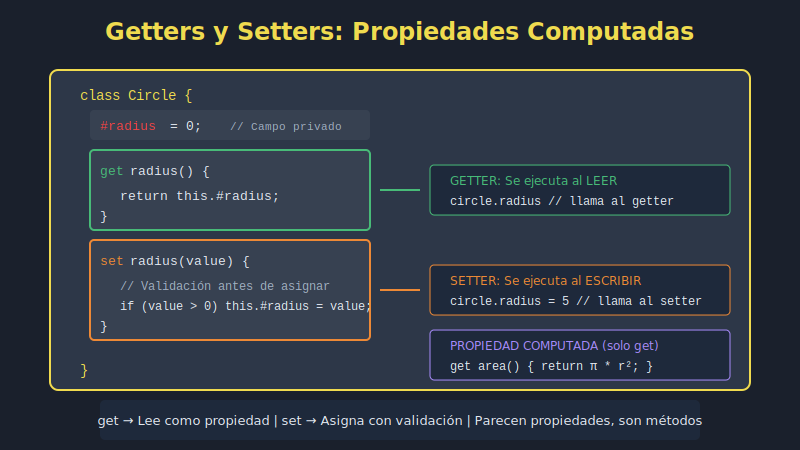

# 📘 Getters y Setters en JavaScript ES2023

## 🎯 Objetivos

- Comprender qué son los getters y setters
- Implementar propiedades computadas con `get` y `set`
- Aplicar validación de datos con setters
- Crear propiedades de solo lectura
- Usar getters para valores derivados

---

## �️ Diagrama



---

## �📋 Contenido

### 1. ¿Qué son Getters y Setters?

Los **getters** y **setters** son métodos especiales que permiten definir cómo se accede y modifica una propiedad. Se usan como si fueran propiedades normales, pero ejecutan código personalizado.

```javascript
class Circle {
  constructor(radius) {
    this._radius = radius; // Convención: _ indica "privado"
  }

  // Getter - se accede como propiedad
  get radius() {
    return this._radius;
  }

  // Setter - se asigna como propiedad
  set radius(value) {
    if (value <= 0) {
      throw new Error('Radius must be positive');
    }
    this._radius = value;
  }

  // Getter calculado
  get area() {
    return Math.PI * this._radius ** 2;
  }

  get circumference() {
    return 2 * Math.PI * this._radius;
  }
}

const circle = new Circle(5);

// Se acceden como propiedades, no como métodos
console.log(circle.radius);        // 5
console.log(circle.area);          // 78.54...
console.log(circle.circumference); // 31.42...

// Se asignan como propiedades
circle.radius = 10;
console.log(circle.area); // 314.16...

// La validación se ejecuta automáticamente
// circle.radius = -5; // Error: Radius must be positive
```

### 2. Sintaxis de Getters

```javascript
class User {
  constructor(firstName, lastName, birthYear) {
    this.firstName = firstName;
    this.lastName = lastName;
    this.birthYear = birthYear;
  }

  // Getter simple - combina propiedades
  get fullName() {
    return `${this.firstName} ${this.lastName}`;
  }

  // Getter calculado - valor derivado
  get age() {
    return new Date().getFullYear() - this.birthYear;
  }

  // Getter con lógica
  get isAdult() {
    return this.age >= 18;
  }

  // Getter que formatea datos
  get initials() {
    return `${this.firstName[0]}${this.lastName[0]}`.toUpperCase();
  }
}

const user = new User('Ana', 'García', 1995);

console.log(user.fullName); // "Ana García"
console.log(user.age);      // 29 (en 2024)
console.log(user.isAdult);  // true
console.log(user.initials); // "AG"
```

### 3. Sintaxis de Setters

```javascript
class Temperature {
  constructor(celsius = 0) {
    this._celsius = celsius;
  }

  // Getter y setter para Celsius
  get celsius() {
    return this._celsius;
  }

  set celsius(value) {
    if (value < -273.15) {
      throw new Error('Temperature below absolute zero is impossible');
    }
    this._celsius = value;
  }

  // Getter y setter para Fahrenheit (conversión automática)
  get fahrenheit() {
    return this._celsius * 9 / 5 + 32;
  }

  set fahrenheit(value) {
    this.celsius = (value - 32) * 5 / 9; // Usa el setter de celsius
  }

  // Getter y setter para Kelvin
  get kelvin() {
    return this._celsius + 273.15;
  }

  set kelvin(value) {
    this.celsius = value - 273.15;
  }
}

const temp = new Temperature(25);
console.log(temp.celsius);    // 25
console.log(temp.fahrenheit); // 77
console.log(temp.kelvin);     // 298.15

temp.fahrenheit = 100;
console.log(temp.celsius);    // 37.78...

temp.kelvin = 0;
console.log(temp.celsius);    // -273.15
```

### 4. Validación con Setters

Los setters son ideales para validar datos antes de asignarlos:

```javascript
class Product {
  constructor(name, price, stock) {
    // Los setters se llaman en el constructor
    this.name = name;
    this.price = price;
    this.stock = stock;
  }

  get name() {
    return this._name;
  }

  set name(value) {
    if (!value || value.trim().length < 2) {
      throw new Error('Name must be at least 2 characters');
    }
    this._name = value.trim();
  }

  get price() {
    return this._price;
  }

  set price(value) {
    if (typeof value !== 'number' || isNaN(value)) {
      throw new Error('Price must be a number');
    }
    if (value < 0) {
      throw new Error('Price cannot be negative');
    }
    this._price = Math.round(value * 100) / 100; // Redondea a 2 decimales
  }

  get stock() {
    return this._stock;
  }

  set stock(value) {
    if (!Number.isInteger(value)) {
      throw new Error('Stock must be an integer');
    }
    if (value < 0) {
      throw new Error('Stock cannot be negative');
    }
    this._stock = value;
  }

  // Getters derivados
  get isAvailable() {
    return this._stock > 0;
  }

  get formattedPrice() {
    return `$${this._price.toFixed(2)}`;
  }
}

const product = new Product('Laptop', 999.999, 10);
console.log(product.price);          // 1000 (redondeado)
console.log(product.formattedPrice); // "$1000.00"
console.log(product.isAvailable);    // true

// Validaciones automáticas
// product.price = -50;  // Error: Price cannot be negative
// product.stock = 5.5;  // Error: Stock must be an integer
// product.name = 'A';   // Error: Name must be at least 2 characters
```

### 5. Propiedades de Solo Lectura

Define solo un getter sin setter:

```javascript
class Order {
  constructor(items) {
    this._items = [...items]; // Copia defensiva
    this._createdAt = new Date();
    this._id = crypto.randomUUID();
  }

  // Solo lectura - no se puede modificar
  get id() {
    return this._id;
  }

  get createdAt() {
    return new Date(this._createdAt); // Retorna copia
  }

  get items() {
    return [...this._items]; // Retorna copia
  }

  get itemCount() {
    return this._items.length;
  }

  get total() {
    return this._items.reduce((sum, item) => sum + item.price * item.quantity, 0);
  }

  get formattedTotal() {
    return `$${this.total.toFixed(2)}`;
  }

  // Métodos para modificar (controlado)
  addItem(item) {
    this._items.push(item);
    return this;
  }

  removeItem(index) {
    this._items.splice(index, 1);
    return this;
  }
}

const order = new Order([
  { name: 'Book', price: 25, quantity: 2 },
  { name: 'Pen', price: 5, quantity: 3 }
]);

console.log(order.id);             // UUID generado
console.log(order.total);          // 65
console.log(order.formattedTotal); // "$65.00"

// Intentar modificar propiedades de solo lectura no tiene efecto
order.id = 'hacked'; // No hace nada (sin setter)
console.log(order.id); // Sigue siendo el UUID original

// Las copias protegen los datos internos
const items = order.items;
items.push({ name: 'Hacked', price: 0, quantity: 0 });
console.log(order.itemCount); // 2 (no afectó al original)
```

### 6. Getters con Caché (Lazy Evaluation)

```javascript
class DataProcessor {
  constructor(data) {
    this._data = data;
    this._cache = new Map();
  }

  get data() {
    return this._data;
  }

  set data(value) {
    this._data = value;
    this._cache.clear(); // Invalida caché cuando cambian los datos
  }

  // Getter con caché
  get statistics() {
    if (this._cache.has('statistics')) {
      console.log('Returning cached statistics');
      return this._cache.get('statistics');
    }

    console.log('Computing statistics...');
    const stats = {
      count: this._data.length,
      sum: this._data.reduce((a, b) => a + b, 0),
      average: this._data.reduce((a, b) => a + b, 0) / this._data.length,
      min: Math.min(...this._data),
      max: Math.max(...this._data)
    };

    this._cache.set('statistics', stats);
    return stats;
  }

  get sorted() {
    if (this._cache.has('sorted')) {
      return this._cache.get('sorted');
    }

    const sorted = [...this._data].sort((a, b) => a - b);
    this._cache.set('sorted', sorted);
    return sorted;
  }
}

const processor = new DataProcessor([5, 2, 8, 1, 9, 3, 7]);

console.log(processor.statistics); // "Computing statistics..." + resultado
console.log(processor.statistics); // "Returning cached statistics" + resultado

processor.data = [10, 20, 30]; // Cambia datos, invalida caché
console.log(processor.statistics); // "Computing statistics..." (recalcula)
```

### 7. Getters y Setters en Herencia

```javascript
class Person {
  constructor(name, email) {
    this._name = name;
    this._email = email;
  }

  get name() {
    return this._name;
  }

  set name(value) {
    if (!value?.trim()) {
      throw new Error('Name is required');
    }
    this._name = value.trim();
  }

  get email() {
    return this._email;
  }

  set email(value) {
    if (!value?.includes('@')) {
      throw new Error('Invalid email format');
    }
    this._email = value.toLowerCase();
  }
}

class Employee extends Person {
  constructor(name, email, department) {
    super(name, email);
    this._department = department;
    this._salary = 0;
  }

  get department() {
    return this._department;
  }

  set department(value) {
    const validDepts = ['Engineering', 'Sales', 'Marketing', 'HR'];
    if (!validDepts.includes(value)) {
      throw new Error(`Invalid department. Valid: ${validDepts.join(', ')}`);
    }
    this._department = value;
  }

  get salary() {
    return this._salary;
  }

  set salary(value) {
    if (value < 0) {
      throw new Error('Salary cannot be negative');
    }
    this._salary = value;
  }

  // Getter que usa getters heredados
  get displayInfo() {
    return `${this.name} (${this.email}) - ${this.department}`;
  }
}

const emp = new Employee('Ana García', 'ANA@EMAIL.COM', 'Engineering');
console.log(emp.email);       // "ana@email.com" (normalizado)
console.log(emp.displayInfo); // "Ana García (ana@email.com) - Engineering"
```

### 8. Ejemplo Completo: Carrito de Compras

```javascript
class CartItem {
  constructor(product, quantity = 1) {
    this._product = product;
    this.quantity = quantity; // Usa el setter
  }

  get product() {
    return this._product;
  }

  get quantity() {
    return this._quantity;
  }

  set quantity(value) {
    if (!Number.isInteger(value) || value < 1) {
      throw new Error('Quantity must be a positive integer');
    }
    this._quantity = value;
  }

  get subtotal() {
    return this._product.price * this._quantity;
  }

  get formattedSubtotal() {
    return `$${this.subtotal.toFixed(2)}`;
  }
}

class ShoppingCart {
  constructor() {
    this._items = [];
    this._discount = 0;
  }

  get items() {
    return [...this._items];
  }

  get itemCount() {
    return this._items.reduce((count, item) => count + item.quantity, 0);
  }

  get subtotal() {
    return this._items.reduce((sum, item) => sum + item.subtotal, 0);
  }

  get discount() {
    return this._discount;
  }

  set discount(value) {
    if (value < 0 || value > 100) {
      throw new Error('Discount must be between 0 and 100');
    }
    this._discount = value;
  }

  get discountAmount() {
    return this.subtotal * (this._discount / 100);
  }

  get total() {
    return this.subtotal - this.discountAmount;
  }

  get isEmpty() {
    return this._items.length === 0;
  }

  get summary() {
    return {
      items: this.itemCount,
      subtotal: this.subtotal,
      discount: this.discountAmount,
      total: this.total
    };
  }

  // Métodos
  addItem(product, quantity = 1) {
    const existingItem = this._items.find(
      item => item.product.id === product.id
    );

    if (existingItem) {
      existingItem.quantity += quantity;
    } else {
      this._items.push(new CartItem(product, quantity));
    }

    return this;
  }

  removeItem(productId) {
    this._items = this._items.filter(item => item.product.id !== productId);
    return this;
  }

  updateQuantity(productId, quantity) {
    const item = this._items.find(item => item.product.id === productId);
    if (item) {
      item.quantity = quantity;
    }
    return this;
  }

  clear() {
    this._items = [];
    this._discount = 0;
    return this;
  }

  checkout() {
    if (this.isEmpty) {
      throw new Error('Cart is empty');
    }

    const order = {
      items: this.items.map(item => ({
        name: item.product.name,
        price: item.product.price,
        quantity: item.quantity,
        subtotal: item.subtotal
      })),
      ...this.summary,
      date: new Date()
    };

    this.clear();
    return order;
  }
}

// Uso
const cart = new ShoppingCart();

cart.addItem({ id: 1, name: 'Laptop', price: 999 })
    .addItem({ id: 2, name: 'Mouse', price: 29 }, 2)
    .addItem({ id: 1, name: 'Laptop', price: 999 }); // Incrementa cantidad

console.log(cart.itemCount);  // 4
console.log(cart.subtotal);   // 2056

cart.discount = 10; // 10% de descuento
console.log(cart.discountAmount); // 205.6
console.log(cart.total);          // 1850.4

console.log(cart.summary);
// { items: 4, subtotal: 2056, discount: 205.6, total: 1850.4 }

const order = cart.checkout();
console.log(cart.isEmpty); // true (carrito vaciado)
```

---

## 💡 Mejores Prácticas

### ✅ Hacer

```javascript
// Usar getters para valores derivados
get fullName() {
  return `${this.firstName} ${this.lastName}`;
}

// Usar setters para validación
set age(value) {
  if (value < 0) throw new Error('Age cannot be negative');
  this._age = value;
}

// Retornar copias para proteger datos internos
get items() {
  return [...this._items];
}
```

### ❌ Evitar

```javascript
// Getters con efectos secundarios
get data() {
  this.fetchFromAPI(); // ❌ No hacer llamadas async en getters
  return this._data;
}

// Setters que hacen demasiado
set user(value) {
  this._user = value;
  this.saveToDatabase(); // ❌ Demasiada lógica
  this.sendEmail();
  this.logActivity();
}
```

---

## 📚 Recursos Adicionales

- [MDN: get](https://developer.mozilla.org/es/docs/Web/JavaScript/Reference/Functions/get)
- [MDN: set](https://developer.mozilla.org/es/docs/Web/JavaScript/Reference/Functions/set)
- [JavaScript.info: Property getters and setters](https://javascript.info/property-accessors)

---

## ✅ Checklist de Verificación

- [ ] Sé crear getters con la palabra clave `get`
- [ ] Sé crear setters con la palabra clave `set`
- [ ] Puedo usar getters para valores derivados/calculados
- [ ] Puedo implementar validación en setters
- [ ] Entiendo cómo crear propiedades de solo lectura
- [ ] Sé proteger datos internos retornando copias
