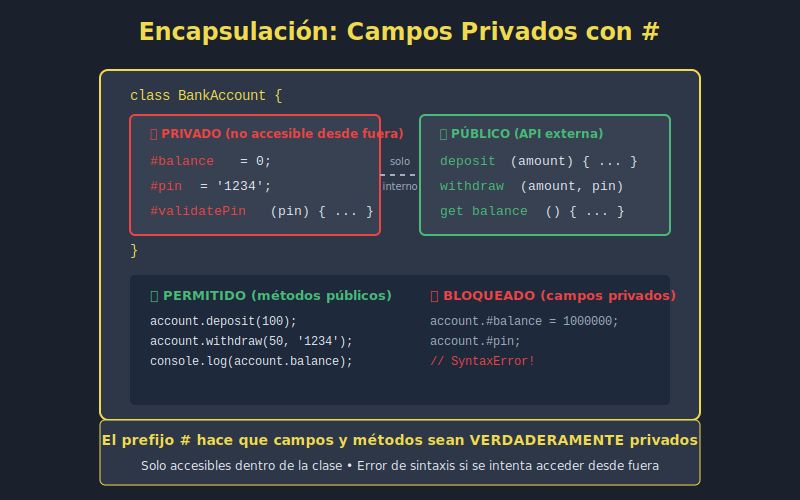

# 📘 Campos Privados en JavaScript ES2023

## 🎯 Objetivos

- Comprender la encapsulación en JavaScript
- Usar campos privados con la sintaxis `#`
- Implementar métodos privados
- Combinar campos privados con getters/setters
- Aplicar patrones de encapsulación seguros

---

## �️ Diagrama



---

## �📋 Contenido

### 1. ¿Qué son los Campos Privados?

Los **campos privados** (introducidos en ES2022) son propiedades que solo pueden ser accedidas desde dentro de la clase. Se declaran con el prefijo `#`.

```javascript
class BankAccount {
  // Campo privado - solo accesible dentro de la clase
  #balance = 0;
  #pin;

  constructor(owner, initialBalance, pin) {
    this.owner = owner;         // Público
    this.#balance = initialBalance; // Privado
    this.#pin = pin;            // Privado
  }

  deposit(amount) {
    if (amount > 0) {
      this.#balance += amount;
      return true;
    }
    return false;
  }

  withdraw(amount, pin) {
    if (pin !== this.#pin) {
      throw new Error('Invalid PIN');
    }
    if (amount > this.#balance) {
      throw new Error('Insufficient funds');
    }
    this.#balance -= amount;
    return amount;
  }

  getBalance(pin) {
    if (pin !== this.#pin) {
      throw new Error('Invalid PIN');
    }
    return this.#balance;
  }
}

const account = new BankAccount('Ana García', 1000, '1234');

account.deposit(500);
console.log(account.getBalance('1234')); // 1500
console.log(account.withdraw(200, '1234')); // 200

// ❌ No se puede acceder desde fuera
// console.log(account.#balance); // SyntaxError
// console.log(account.#pin);     // SyntaxError

// Tampoco aparecen en la iteración
console.log(Object.keys(account)); // ['owner']
```

### 2. Diferencia con la Convención `_`

Antes de los campos privados, se usaba el prefijo `_` como convención:

```javascript
// ❌ ANTES: Convención _ (no es realmente privado)
class OldStyle {
  constructor(secret) {
    this._secret = secret; // Convención, pero accesible
  }
}

const old = new OldStyle('password');
console.log(old._secret); // "password" - ¡Accesible!

// ✅ AHORA: Campos privados reales con #
class NewStyle {
  #secret;

  constructor(secret) {
    this.#secret = secret;
  }

  reveal(password) {
    if (password === 'please') {
      return this.#secret;
    }
    return '***';
  }
}

const modern = new NewStyle('password');
// console.log(modern.#secret); // SyntaxError
console.log(modern.reveal('please')); // "password"
```

### 3. Métodos Privados

También puedes crear métodos privados:

```javascript
class PasswordManager {
  #passwords = new Map();
  #masterKey;

  constructor(masterKey) {
    this.#masterKey = this.#hash(masterKey);
  }

  // Método privado - solo uso interno
  #hash(value) {
    // Simulación de hash (en producción usar crypto)
    return value.split('').reduce((hash, char) => {
      return ((hash << 5) - hash) + char.charCodeAt(0);
    }, 0).toString(16);
  }

  #validateMaster(key) {
    return this.#hash(key) === this.#masterKey;
  }

  #encrypt(data) {
    // Simulación de encriptación
    return btoa(data);
  }

  #decrypt(data) {
    return atob(data);
  }

  // Métodos públicos
  addPassword(masterKey, site, password) {
    if (!this.#validateMaster(masterKey)) {
      throw new Error('Invalid master key');
    }
    this.#passwords.set(site, this.#encrypt(password));
    return true;
  }

  getPassword(masterKey, site) {
    if (!this.#validateMaster(masterKey)) {
      throw new Error('Invalid master key');
    }
    const encrypted = this.#passwords.get(site);
    return encrypted ? this.#decrypt(encrypted) : null;
  }

  listSites(masterKey) {
    if (!this.#validateMaster(masterKey)) {
      throw new Error('Invalid master key');
    }
    return [...this.#passwords.keys()];
  }
}

const manager = new PasswordManager('myMasterKey123');
manager.addPassword('myMasterKey123', 'github.com', 'gh_secret_123');
manager.addPassword('myMasterKey123', 'gmail.com', 'gmail_pass_456');

console.log(manager.getPassword('myMasterKey123', 'github.com')); // "gh_secret_123"
console.log(manager.listSites('myMasterKey123')); // ['github.com', 'gmail.com']

// ❌ No se pueden llamar métodos privados
// manager.#hash('test');      // SyntaxError
// manager.#validateMaster(''); // SyntaxError
```

### 4. Campos Privados Estáticos

```javascript
class ApiClient {
  // Campo privado estático
  static #instance = null;
  static #baseUrl = 'https://api.example.com';
  static #apiKey;

  #requestCount = 0;

  constructor() {
    if (ApiClient.#instance) {
      return ApiClient.#instance;
    }
    ApiClient.#instance = this;
  }

  // Método estático privado
  static #formatEndpoint(path) {
    return `${ApiClient.#baseUrl}${path}`;
  }

  static configure(apiKey, baseUrl) {
    ApiClient.#apiKey = apiKey;
    if (baseUrl) {
      ApiClient.#baseUrl = baseUrl;
    }
  }

  async get(path) {
    this.#requestCount++;
    const url = ApiClient.#formatEndpoint(path);

    // Simulación de request
    console.log(`GET ${url} (Request #${this.#requestCount})`);
    console.log(`Using API Key: ${ApiClient.#apiKey?.slice(0, 4)}****`);

    return { success: true, url };
  }

  getRequestCount() {
    return this.#requestCount;
  }
}

ApiClient.configure('sk-1234567890abcdef');

const client1 = new ApiClient();
const client2 = new ApiClient();

console.log(client1 === client2); // true (singleton)

client1.get('/users');
client2.get('/products');

console.log(client1.getRequestCount()); // 2
```

### 5. Combinando con Getters y Setters

```javascript
class User {
  #id;
  #email;
  #password;
  #createdAt;
  #loginAttempts = 0;
  #isLocked = false;

  static #idCounter = 0;
  static #MAX_ATTEMPTS = 3;

  constructor(email, password) {
    this.#id = ++User.#idCounter;
    this.#createdAt = new Date();
    this.email = email;       // Usa setter
    this.password = password; // Usa setter
  }

  // Getter para ID (solo lectura)
  get id() {
    return this.#id;
  }

  // Getter para fecha de creación (solo lectura)
  get createdAt() {
    return new Date(this.#createdAt);
  }

  // Getter/Setter para email con validación
  get email() {
    return this.#email;
  }

  set email(value) {
    if (!value?.includes('@')) {
      throw new Error('Invalid email format');
    }
    this.#email = value.toLowerCase().trim();
  }

  // Solo setter para password (no se puede leer)
  set password(value) {
    if (value.length < 8) {
      throw new Error('Password must be at least 8 characters');
    }
    // Simulación de hash
    this.#password = `hashed_${value}_${Date.now()}`;
  }

  get isLocked() {
    return this.#isLocked;
  }

  // Métodos privados para autenticación
  #verifyPassword(password) {
    // En producción: comparar hashes
    return this.#password.includes(password);
  }

  #resetAttempts() {
    this.#loginAttempts = 0;
    this.#isLocked = false;
  }

  #incrementAttempts() {
    this.#loginAttempts++;
    if (this.#loginAttempts >= User.#MAX_ATTEMPTS) {
      this.#isLocked = true;
    }
  }

  // Métodos públicos
  login(password) {
    if (this.#isLocked) {
      throw new Error('Account is locked. Contact support.');
    }

    if (this.#verifyPassword(password)) {
      this.#resetAttempts();
      return { success: true, message: 'Login successful' };
    }

    this.#incrementAttempts();
    const remaining = User.#MAX_ATTEMPTS - this.#loginAttempts;

    return {
      success: false,
      message: `Invalid password. ${remaining} attempts remaining.`
    };
  }

  unlock(adminKey) {
    if (adminKey === 'admin123') { // Simplificado para ejemplo
      this.#resetAttempts();
      return true;
    }
    return false;
  }

  toJSON() {
    return {
      id: this.#id,
      email: this.#email,
      createdAt: this.#createdAt.toISOString(),
      isLocked: this.#isLocked
      // ¡No incluye password!
    };
  }
}

const user = new User('ANA@EMAIL.COM', 'securePassword123');

console.log(user.id);        // 1
console.log(user.email);     // "ana@email.com"
console.log(user.createdAt); // Date object

// No se puede leer el password
// console.log(user.password); // undefined (no hay getter)

// Intentos de login
console.log(user.login('wrong'));    // { success: false, message: '...' }
console.log(user.login('wrong'));    // { success: false, message: '...' }
console.log(user.login('wrong'));    // { success: false, message: '...' }
console.log(user.isLocked);          // true

user.unlock('admin123');
console.log(user.login('securePassword123')); // { success: true }

console.log(JSON.stringify(user.toJSON(), null, 2));
```

### 6. Herencia y Campos Privados

Los campos privados NO se heredan directamente:

```javascript
class Animal {
  #name;
  #energy = 100;

  constructor(name) {
    this.#name = name;
  }

  get name() {
    return this.#name;
  }

  get energy() {
    return this.#energy;
  }

  // Método protegido (accesible por subclases vía método público)
  consumeEnergy(amount) {
    this.#energy = Math.max(0, this.#energy - amount);
  }

  rest() {
    this.#energy = Math.min(100, this.#energy + 20);
    return `${this.#name} is resting. Energy: ${this.#energy}`;
  }
}

class Dog extends Animal {
  #breed;

  constructor(name, breed) {
    super(name);
    this.#breed = breed;
  }

  get breed() {
    return this.#breed;
  }

  bark() {
    this.consumeEnergy(5); // Usa método público del padre
    return `${this.name} barks! Woof! (Energy: ${this.energy})`;
  }

  run() {
    this.consumeEnergy(15);
    return `${this.name} is running! (Energy: ${this.energy})`;
  }

  // ❌ No puede acceder a #energy del padre
  // getEnergy() {
  //   return this.#energy; // SyntaxError - #energy es de Animal
  // }
}

const dog = new Dog('Max', 'Labrador');
console.log(dog.name);   // "Max"
console.log(dog.breed);  // "Labrador"
console.log(dog.energy); // 100

console.log(dog.bark()); // "Max barks! Woof! (Energy: 95)"
console.log(dog.run());  // "Max is running! (Energy: 80)"
console.log(dog.rest()); // "Max is resting. Energy: 100"
```

### 7. Patrón: Configuración Inmutable

```javascript
class AppConfig {
  #settings;
  #frozen = false;

  constructor(initialSettings = {}) {
    this.#settings = {
      theme: 'dark',
      language: 'es',
      notifications: true,
      autoSave: true,
      ...initialSettings
    };
  }

  get(key) {
    return this.#settings[key];
  }

  set(key, value) {
    if (this.#frozen) {
      throw new Error('Config is frozen and cannot be modified');
    }
    if (!(key in this.#settings)) {
      throw new Error(`Unknown setting: ${key}`);
    }
    this.#settings[key] = value;
    return this;
  }

  getAll() {
    return { ...this.#settings }; // Copia
  }

  freeze() {
    this.#frozen = true;
    return this;
  }

  get isFrozen() {
    return this.#frozen;
  }
}

const config = new AppConfig({ theme: 'light' });

console.log(config.get('theme'));    // "light"
console.log(config.get('language')); // "es"

config.set('notifications', false);
console.log(config.getAll());

config.freeze();
// config.set('theme', 'dark'); // Error: Config is frozen
```

### 8. Ejemplo Completo: Sistema de Autenticación

```javascript
class AuthService {
  static #instance = null;
  #users = new Map();
  #sessions = new Map();
  #tokenSecret = 'super_secret_key_123';

  constructor() {
    if (AuthService.#instance) {
      return AuthService.#instance;
    }
    AuthService.#instance = this;
  }

  // Métodos privados
  #hashPassword(password) {
    // Simulación - en producción usar bcrypt
    return `hash_${password}_${this.#tokenSecret.slice(0, 5)}`;
  }

  #generateToken(userId) {
    const payload = `${userId}_${Date.now()}_${Math.random()}`;
    return btoa(payload);
  }

  #validateToken(token) {
    return this.#sessions.has(token);
  }

  // Métodos públicos
  register(email, password, name) {
    if (this.#users.has(email)) {
      return { success: false, error: 'Email already registered' };
    }

    const user = {
      id: crypto.randomUUID(),
      email,
      password: this.#hashPassword(password),
      name,
      createdAt: new Date()
    };

    this.#users.set(email, user);

    return {
      success: true,
      user: { id: user.id, email: user.email, name: user.name }
    };
  }

  login(email, password) {
    const user = this.#users.get(email);

    if (!user) {
      return { success: false, error: 'User not found' };
    }

    if (user.password !== this.#hashPassword(password)) {
      return { success: false, error: 'Invalid password' };
    }

    const token = this.#generateToken(user.id);
    this.#sessions.set(token, {
      userId: user.id,
      createdAt: new Date(),
      expiresAt: new Date(Date.now() + 24 * 60 * 60 * 1000) // 24h
    });

    return {
      success: true,
      token,
      user: { id: user.id, email: user.email, name: user.name }
    };
  }

  logout(token) {
    const deleted = this.#sessions.delete(token);
    return { success: deleted };
  }

  getCurrentUser(token) {
    if (!this.#validateToken(token)) {
      return null;
    }

    const session = this.#sessions.get(token);
    if (new Date() > session.expiresAt) {
      this.#sessions.delete(token);
      return null;
    }

    for (const [, user] of this.#users) {
      if (user.id === session.userId) {
        return { id: user.id, email: user.email, name: user.name };
      }
    }

    return null;
  }

  get userCount() {
    return this.#users.size;
  }

  get activeSessionCount() {
    return this.#sessions.size;
  }
}

// Uso
const auth = new AuthService();

// Registro
console.log(auth.register('ana@email.com', 'password123', 'Ana García'));
// { success: true, user: { id: '...', email: 'ana@email.com', name: 'Ana García' } }

// Login
const loginResult = auth.login('ana@email.com', 'password123');
console.log(loginResult);
// { success: true, token: '...', user: { ... } }

// Obtener usuario actual
const currentUser = auth.getCurrentUser(loginResult.token);
console.log(currentUser);
// { id: '...', email: 'ana@email.com', name: 'Ana García' }

// Estadísticas
console.log(`Users: ${auth.userCount}, Sessions: ${auth.activeSessionCount}`);

// Logout
console.log(auth.logout(loginResult.token));
// { success: true }
```

---

## 💡 Mejores Prácticas

### ✅ Hacer

```javascript
// Usar # para datos sensibles
class User {
  #password;
  #creditCard;
}

// Exponer solo lo necesario con getters
get publicData() {
  return { name: this.name, email: this.email };
}

// Combinar con validación en setters
set email(value) {
  if (this.#validateEmail(value)) {
    this.#email = value;
  }
}
```

### ❌ Evitar

```javascript
// No usar # para todo
class Point {
  #x; // ❌ Innecesario para datos no sensibles
  #y;
}

// No duplicar getters triviales
class User {
  #name;
  get name() { return this.#name; }
  set name(v) { this.#name = v; }
  // Si no hay validación, ¿para qué el campo privado?
}
```

---

## 📚 Recursos Adicionales

- [MDN: Private class fields](https://developer.mozilla.org/en-US/docs/Web/JavaScript/Reference/Classes/Private_class_fields)
- [JavaScript.info: Private and protected properties](https://javascript.info/private-protected-properties-methods)
- [TC39: Class Fields Proposal](https://github.com/tc39/proposal-class-fields)

---

## ✅ Checklist de Verificación

- [ ] Sé declarar campos privados con `#`
- [ ] Puedo crear métodos privados
- [ ] Entiendo la diferencia entre `_` (convención) y `#` (privado real)
- [ ] Sé combinar campos privados con getters/setters
- [ ] Puedo crear campos privados estáticos
- [ ] Entiendo las limitaciones con herencia
- [ ] Sé aplicar encapsulación para proteger datos sensibles
