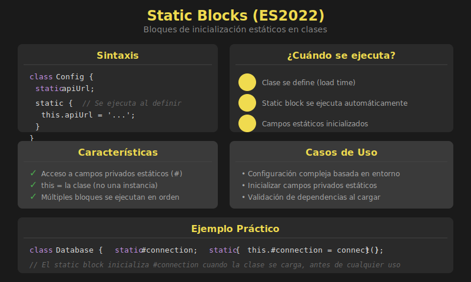

# 📘 Static Blocks en JavaScript ES2022

## 🎯 Objetivos

- Comprender qué son los bloques de inicialización estáticos
- Usar `static {}` para configuración compleja de clases
- Aplicar static blocks en escenarios prácticos
- Combinar static blocks con campos privados estáticos

---

## 🖼️ Diagrama



---

## 📋 Contenido

### 1. ¿Qué son los Static Blocks?

Los **static blocks** (bloques de inicialización estáticos), introducidos en ES2022, permiten ejecutar código durante la definición de una clase. Son útiles para inicializar campos estáticos que requieren lógica compleja.

```javascript
class Config {
  static environment;
  static apiUrl;
  static debug;

  // Static block - se ejecuta cuando la clase se define
  static {
    // Lógica de inicialización compleja
    this.environment = process.env.NODE_ENV || 'development';

    if (this.environment === 'production') {
      this.apiUrl = 'https://api.example.com';
      this.debug = false;
    } else {
      this.apiUrl = 'http://localhost:3000';
      this.debug = true;
    }

    console.log(`Config initialized for ${this.environment}`);
  }
}

// El static block ya se ejecutó cuando la clase se definió
console.log(Config.environment); // 'development'
console.log(Config.apiUrl);      // 'http://localhost:3000'
console.log(Config.debug);       // true
```

### 2. ¿Por qué necesitamos Static Blocks?

Antes de ES2022, la inicialización compleja de campos estáticos era problemática:

```javascript
// ❌ ANTES: Soluciones incómodas

// Opción 1: IIFE (Immediately Invoked Function Expression)
class OldConfig {
  static environment = (() => {
    return process.env.NODE_ENV || 'development';
  })();
}

// Opción 2: Inicialización externa (rompe encapsulación)
class OldConfig2 {
  static environment;
}
OldConfig2.environment = process.env.NODE_ENV || 'development';

// ✅ AHORA: Static blocks (limpio y encapsulado)
class NewConfig {
  static environment;

  static {
    this.environment = process.env.NODE_ENV || 'development';
  }
}
```

### 3. Sintaxis y Características

```javascript
class Example {
  static publicField = 'public';
  static #privateField;

  // Puedes tener múltiples static blocks
  static {
    console.log('Primer static block');
    this.#privateField = 'initialized';
  }

  static {
    console.log('Segundo static block');
    // Se ejecutan en orden de aparición
  }

  static getPrivate() {
    return this.#privateField;
  }
}

// Salida:
// "Primer static block"
// "Segundo static block"

console.log(Example.publicField);    // 'public'
console.log(Example.getPrivate());   // 'initialized'
```

**Características clave:**

- Se ejecutan en el orden en que aparecen
- Tienen acceso a campos privados estáticos
- `this` se refiere a la clase (no a una instancia)
- Se ejecutan una sola vez, al definir la clase
- Pueden contener cualquier lógica JavaScript

### 4. Acceso a Campos Privados Estáticos

Una ventaja importante de static blocks es el acceso a campos privados:

```javascript
class SecureStorage {
  static #encryptionKey;
  static #algorithm = 'AES-256';

  // Static block puede inicializar campos privados con lógica compleja
  static {
    // Generar clave de encriptación
    this.#encryptionKey = this.#generateKey();
    console.log('Encryption key generated');
  }

  static #generateKey() {
    // Simulación de generación de clave
    return Array.from({ length: 32 }, () =>
      Math.random().toString(36).charAt(2)
    ).join('');
  }

  static encrypt(data) {
    // Usar campos privados
    return `${this.#algorithm}:${btoa(data)}:${this.#encryptionKey.slice(0, 8)}`;
  }

  static decrypt(encrypted) {
    const [algorithm, data] = encrypted.split(':');
    return atob(data);
  }
}

const encrypted = SecureStorage.encrypt('secret message');
console.log(encrypted);
console.log(SecureStorage.decrypt(encrypted)); // 'secret message'

// ❌ No se puede acceder a los campos privados
// console.log(SecureStorage.#encryptionKey); // SyntaxError
```

### 5. Casos de Uso Prácticos

#### 5.1 Singleton Pattern

```javascript
class Database {
  static #instance;
  static #connection;

  static {
    // Configurar singleton en static block
    this.#instance = null;
    this.#connection = null;
  }

  constructor(connectionString) {
    if (Database.#instance) {
      return Database.#instance;
    }

    this.connectionString = connectionString;
    Database.#instance = this;
    Database.#connection = this.#connect();
  }

  #connect() {
    console.log(`Connecting to ${this.connectionString}...`);
    return { connected: true, timestamp: Date.now() };
  }

  static getInstance() {
    if (!this.#instance) {
      throw new Error('Database not initialized. Create an instance first.');
    }
    return this.#instance;
  }

  static getConnection() {
    return this.#connection;
  }

  query(sql) {
    if (!Database.#connection?.connected) {
      throw new Error('Not connected');
    }
    console.log(`Executing: ${sql}`);
    return { rows: [], sql };
  }
}

// Uso
const db1 = new Database('mongodb://localhost:27017');
const db2 = new Database('different-string'); // Retorna db1 (singleton)

console.log(db1 === db2); // true
console.log(Database.getConnection()); // { connected: true, ... }
```

#### 5.2 Registro de Clases (Class Registry)

```javascript
class PluginRegistry {
  static #plugins = new Map();
  static #initialized = false;

  static {
    // Configurar plugins por defecto
    this.#plugins.set('logger', {
      name: 'Default Logger',
      log: msg => console.log(`[LOG] ${msg}`)
    });

    this.#plugins.set('formatter', {
      name: 'Default Formatter',
      format: data => JSON.stringify(data, null, 2)
    });

    this.#initialized = true;
    console.log('Plugin registry initialized with defaults');
  }

  static register(name, plugin) {
    if (this.#plugins.has(name)) {
      console.warn(`Plugin "${name}" already exists. Overwriting...`);
    }
    this.#plugins.set(name, plugin);
    return this;
  }

  static get(name) {
    return this.#plugins.get(name);
  }

  static list() {
    return [...this.#plugins.keys()];
  }

  static isInitialized() {
    return this.#initialized;
  }
}

// Usar el registro
console.log(PluginRegistry.isInitialized()); // true
console.log(PluginRegistry.list()); // ['logger', 'formatter']

PluginRegistry.register('validator', {
  name: 'Custom Validator',
  validate: data => data !== null
});

const logger = PluginRegistry.get('logger');
logger.log('Hello from plugin!'); // [LOG] Hello from plugin!
```

#### 5.3 Configuración basada en Entorno

```javascript
class AppConfig {
  static #config;
  static #secrets;

  static {
    const env = typeof process !== 'undefined'
      ? process.env.NODE_ENV
      : 'browser';

    // Configuración base
    const baseConfig = {
      appName: 'MyApp',
      version: '1.0.0',
      features: {
        darkMode: true,
        notifications: true
      }
    };

    // Configuración por entorno
    const envConfigs = {
      development: {
        apiUrl: 'http://localhost:3000/api',
        debug: true,
        logLevel: 'debug'
      },
      staging: {
        apiUrl: 'https://staging-api.example.com',
        debug: true,
        logLevel: 'info'
      },
      production: {
        apiUrl: 'https://api.example.com',
        debug: false,
        logLevel: 'error'
      },
      browser: {
        apiUrl: '/api',
        debug: true,
        logLevel: 'info'
      }
    };

    this.#config = {
      ...baseConfig,
      ...envConfigs[env] || envConfigs.development,
      env
    };

    // Secretos (solo en server)
    this.#secrets = env !== 'browser' ? {
      apiKey: process.env.API_KEY || 'dev-key',
      dbPassword: process.env.DB_PASSWORD || 'dev-password'
    } : null;

    console.log(`AppConfig initialized for: ${env}`);
  }

  static get(key) {
    return key ? this.#config[key] : { ...this.#config };
  }

  static getSecret(key) {
    if (!this.#secrets) {
      throw new Error('Secrets not available in browser');
    }
    return this.#secrets[key];
  }

  static isProduction() {
    return this.#config.env === 'production';
  }

  static isDebugEnabled() {
    return this.#config.debug;
  }
}

// Uso
console.log(AppConfig.get('apiUrl'));      // Depende del entorno
console.log(AppConfig.get('debug'));       // true/false
console.log(AppConfig.isDebugEnabled());   // true/false
console.log(AppConfig.get());              // Toda la config (sin secretos)
```

#### 5.4 Validación de Dependencias

```javascript
class HttpClient {
  static #fetchFn;
  static #supported = false;

  static {
    // Verificar disponibilidad de fetch
    if (typeof fetch === 'function') {
      this.#fetchFn = fetch.bind(globalThis);
      this.#supported = true;
    } else if (typeof globalThis.XMLHttpRequest !== 'undefined') {
      // Fallback a XHR
      this.#fetchFn = (url, options) => {
        return new Promise((resolve, reject) => {
          const xhr = new XMLHttpRequest();
          xhr.open(options?.method || 'GET', url);
          xhr.onload = () => resolve({
            ok: xhr.status >= 200 && xhr.status < 300,
            status: xhr.status,
            json: () => Promise.resolve(JSON.parse(xhr.responseText))
          });
          xhr.onerror = reject;
          xhr.send(options?.body);
        });
      };
      this.#supported = true;
      console.warn('Using XMLHttpRequest fallback');
    } else {
      console.error('No HTTP client available');
    }
  }

  static isSupported() {
    return this.#supported;
  }

  static async get(url) {
    if (!this.#supported) {
      throw new Error('HTTP client not available');
    }
    const response = await this.#fetchFn(url);
    return response.json();
  }

  static async post(url, data) {
    if (!this.#supported) {
      throw new Error('HTTP client not available');
    }
    const response = await this.#fetchFn(url, {
      method: 'POST',
      headers: { 'Content-Type': 'application/json' },
      body: JSON.stringify(data)
    });
    return response.json();
  }
}
```

### 6. Múltiples Static Blocks y Orden de Ejecución

```javascript
class OrderDemo {
  static first = 'first';

  static {
    console.log('1. Primer static block');
    console.log(`   first = ${this.first}`);
    console.log(`   second = ${this.second}`); // undefined aún
  }

  static second = 'second';

  static {
    console.log('2. Segundo static block');
    console.log(`   second = ${this.second}`); // ahora tiene valor
  }

  static third = 'third';

  static {
    console.log('3. Tercer static block');
    console.log(`   Todos los campos: ${this.first}, ${this.second}, ${this.third}`);
  }
}

// Salida:
// 1. Primer static block
//    first = first
//    second = undefined
// 2. Segundo static block
//    second = second
// 3. Tercer static block
//    Todos los campos: first, second, third
```

### 7. Static Blocks en Herencia

```javascript
class Parent {
  static parentValue;

  static {
    this.parentValue = 'from parent';
    console.log('Parent static block');
  }
}

class Child extends Parent {
  static childValue;

  static {
    console.log('Child static block');
    console.log(`Parent value: ${this.parentValue}`); // Heredado
    this.childValue = 'from child';
  }
}

// Salida:
// Parent static block
// Child static block
// Parent value: from parent

console.log(Child.parentValue); // 'from parent'
console.log(Child.childValue);  // 'from child'
```

---

## 📋 Resumen

| Característica | Descripción |
|----------------|-------------|
| Sintaxis | `static { /* código */ }` |
| Ejecución | Al definir la clase, una sola vez |
| Acceso a `this` | Referencia a la clase |
| Campos privados | ✅ Puede acceder y modificar |
| Múltiples bloques | ✅ Se ejecutan en orden |
| Herencia | Los bloques del padre se ejecutan primero |

### Cuándo usar Static Blocks

- ✅ Inicialización compleja de campos estáticos
- ✅ Configuración basada en condiciones
- ✅ Acceso a campos privados estáticos durante inicialización
- ✅ Validación de dependencias al cargar la clase
- ✅ Setup de singletons o registros

---

## 🔗 Recursos Adicionales

- [MDN: Static initialization blocks](https://developer.mozilla.org/en-US/docs/Web/JavaScript/Reference/Classes/Static_initialization_blocks)
- [TC39: Class Static Block Proposal](https://github.com/tc39/proposal-class-static-block)
- [V8: Class Static Initialization Blocks](https://v8.dev/features/class-static-initializer-blocks)

---

## ✅ Checklist de Verificación

- [ ] Entiendo qué es un static block y cuándo se ejecuta
- [ ] Puedo usar `this` para referirme a la clase dentro del bloque
- [ ] Sé acceder a campos privados estáticos desde static blocks
- [ ] Comprendo el orden de ejecución con múltiples bloques
- [ ] Puedo aplicar static blocks para configuración de clases
